# 🌐 TCP/IP Protocol Suite (4-Layer Model)

TCP/IP is the foundational architecture of the Internet. It defines how data is packaged, addressed, transmitted, routed, and received across networks.

It's usually shown in four layers, each with its own responsibilities.

## 1️⃣ Application Layer

### What it does
This is where user-facing applications and network services operate. It provides network services directly to end users or applications.

### Responsibilities
- Define how data is formatted and exchanged for specific tasks
- Provide protocols applications use to communicate
- Handle high-level data like web pages, email, files, APIs

### Common protocols
- **HTTP / HTTPS** – web browsing
- **DNS** – domain name lookup
- **SMTP, IMAP, POP3** – email
- **FTP / SFTP** – file transfer
- **DHCP** – automatic IP assignment

### Analogy
Think of it as the "language" applications use to talk over the network.

## 2️⃣ Transport Layer

### What it does
Provides end-to-end communication between devices. It ensures that data from one application gets to the correct application on another device.

### Responsibilities
- Port numbers (e.g., 80, 443, 22)
- Connection setup/teardown
- Reliable or unreliable delivery
- Segmentation and reassembly of data

### Common protocols

**TCP (Transmission Control Protocol)**

- Reliable, ordered delivery
- Flow control, error correction
- Used by web, email, SSH

**UDP (User Datagram Protocol)**

- Faster, no reliability guarantees
- Used by games, voice/video, DNS queries

## 3️⃣ Internet Layer

### What it does
Moves packets between networks, deciding the best path across the Internet.

### Responsibilities
- Logical addressing (IP addresses)
- Routing between networks
- Packet fragmentation

### Common protocols
- **IP (Internet Protocol)** → the core of the Internet, IPv4 (32-bit), IPv6 (128-bit)
- **ICMP** – errors and diagnostics (ping, traceroute)
- **ARP** – maps IP → MAC (sometimes considered between Internet/Data Link)

## 4️⃣ Data Link Layer

### What it does
Handles communication within a single local network segment (e.g., within your Wi-Fi network or Ethernet LAN).

### Responsibilities
- Physical addressing (MAC addresses)
- Frame formatting
- Access to the physical medium (Wi-Fi radio waves, Ethernet cables)
- Error detection (e.g., FCS checks)

### Common technologies and protocols
- Ethernet (IEEE 802.3)
- Wi-Fi (IEEE 802.11)
- Switches operate at this layer
- MAC addressing

## 📦 How Data Moves Through the Layers (Example)

### If you load a web page

#### Sending (Your computer → Internet)
- **Application Layer:** Browser creates an HTTP request.
- **Transport Layer:** TCP wraps it into **segments** and manages the connection to port 80/443.
- **Internet Layer:** IP adds source/destination IPs and routes it across the internet.
- **Data Link Layer:** Wi-Fi/Ethernet **frames** carry it across your local network.

This downward process through the layers is called **encapsulation**, where each layer adds its own header (and sometimes trailer) to the data from the layer above, creating a protocol data unit (PDU).

#### Receiving (Server → Your computer)
The layers are processed in reverse in a process called **decapsulation**, where each layer removes its header and passes the data upward.

## 🧠 Summary Table

| Layer       | Purpose                          | Examples          |
|-------------|----------------------------------|-------------------|
| Application | App-specific data formats & services | HTTP, DNS, SMTP  |
| Transport   | End-to-end connections, ports, reliability | TCP, UDP         |
| Internet    | Routing, IP addressing           | IP, ICMP, ARP     |
| Data Link   | Local network delivery, MAC addressing | Ethernet, Wi-Fi  |

## 📊 Encapsulation Process Diagram

```mermaid
sequenceDiagram
    participant App as Application Layer
    participant Trans as Transport Layer
    participant Int as Internet Layer
    participant DL as Data Link Layer
    participant Phys as Physical Layer

    Note over App,Phys: Sending (Encapsulation) Process
    App->>App: Adds application headers (e.g., HTTP) → Application PDU
    App->>Trans: Passes application PDU
    Trans->>Trans: Adds transport header → Segment
    Trans->>Int: Passes segment
    Int->>Int: Adds IP header → Packet
    Int->>DL: Passes packet
    DL->>DL: Adds frame header/trailer → Frame
    DL->>Phys: Transmits frame as bits

    Note over Phys,App: Receiving (Decapsulation) Process
    Phys-->>DL: Receives frame
    DL->>DL: Removes frame header/trailer → Packet
    DL-->>Int: Passes packet
    Int->>Int: Removes IP header → Segment
    Int-->>Trans: Passes segment
    Trans->>Trans: Removes transport header → Application PDU
    Trans-->>App: Passes application PDU
    App->>App: Removes application headers → Application data
```

