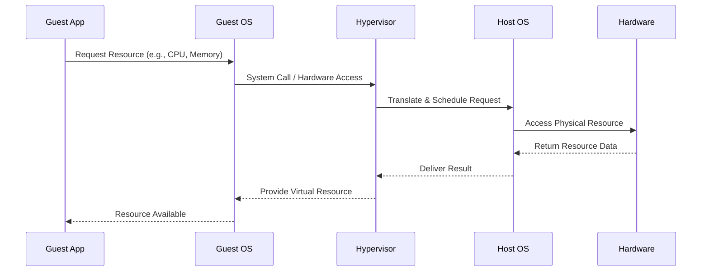

# Virtual Machines

## Overview

A virtual machine (VM) is a software-based emulation of a physical computer system that runs on a host computer. It provides the functionality of a complete hardware platform, allowing multiple operating systems and applications to run simultaneously on a single physical machine.

## How VMs Work

Virtual machines operate through a hypervisor, the software layer that creates and manages them by running on top of a host operating system, such as VirtualBox or VMware Workstation. 

Each VM contains virtualized hardware components including a virtual CPU that allocates processing power from physical CPUs, virtual memory that maps addresses to physical memory, virtual storage presenting disks backed by physical storage, and virtual network interfaces providing connectivity. 

The guest operating system running inside the VM remains unaware of the virtualization, behaving as if it operates on physical hardware, while being able to differ from the host OS to enable cross-platform compatibility.

### Resource Access Diagram

## Examples VM uses

| Use Case | Description |
|----------|-------------|
| **Isolated development environments** | Each developer gets an identical setup, ensuring consistency across teams and preventing conflicts with host system configurations. |
| **Testing different OS versions** | Allows testing software on various operating systems without affecting the host system, facilitating cross-platform compatibility checks. |
| **Running old applications** | Enables legacy software to run on modern hardware that might not natively support older operating systems or architectures. |
| **Operating system migration** | Supports gradual transition between platforms by running the new OS in a VM while maintaining the old one, minimizing downtime. |
| **Malware analysis** | Provides isolated execution environments for threat research, containing potential malware and preventing host system infection. |
| **Secure browsing** | Creates virtual environments for accessing untrusted content, protecting the host from malicious websites or downloads. |
| **Computer science labs** | Offers safe experimentation environments for students to practice system administration, networking, and software deployment without risk. |
| **Disaster recovery training** | Enables safe simulation of failure scenarios, allowing IT teams to practice recovery procedures in controlled, non-destructive settings. |

## Benefits and Limitations of VMs

| Aspect | Benefits | Limitations |
|--------|----------|-------------|
| **Resource Efficiency** | - **Server consolidation**: Reduce physical server count by 70-80% - **Dynamic resource allocation**: Adjust CPU, memory, storage on demand - **Energy savings**: Fewer physical servers mean lower power consumption | - **Memory constraints**: Limited by host physical memory - **Storage I/O**: Shared storage can become bottleneck - **Network bandwidth**: Dependent on host network capabilities |
| **Performance** | - Hardware independence: Run any OS on any hardware - Rapid deployment: Create new VMs in minutes | - CPU overhead: Virtualization adds 5-15% performance penalty - Memory overhead: Hypervisor and VM management consume resources - I/O performance: Virtual storage and network have latency |
| **Flexibility & Scalability** | - Easy migration: Move VMs between physical hosts - Hardware independence: Run any OS on any hardware | - Nested virtualization: Running VMs inside VMs adds overhead - Performance-sensitive applications: May require bare-metal performance |
| **Cost** | - Reduced capital expenditure: Fewer physical servers to purchase - Lower maintenance costs: Centralized management - Improved asset utilization: Better hardware usage rates | - Licensing complexity: Managing multiple OS licenses |
| **Reliability & Availability** | - High availability: Live migration during maintenance - Disaster recovery: Quick restoration from backups - Fault isolation: One VM failure doesn't affect others | - Backup and recovery: More complex than physical systems |
| **Security** | - Isolation: Security breaches contained within VM - Snapshot and rollback: Easy recovery from issues - Access control: Granular permissions and policies | - Hypervisor vulnerabilities: Single point of failure - VM escape attacks: Malware breaking out of VM - Resource contention: Noisy neighbor problems |
| **Management** | - Centralized management of multiple environments | - Learning curve: Requires virtualization expertise - Hardware passthrough: Some devices don't virtualize well |
