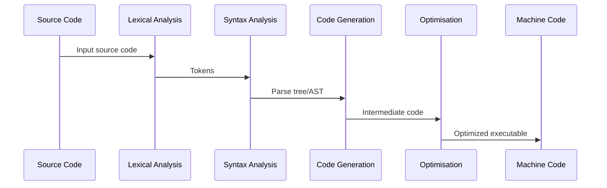

# Translation Software

## Interpreters

An interpreter is a type of translator that executes programs directly from the source code without producing a separate translated version, such as an executable file. Instead of converting the entire program into machine code beforehand, an interpreter reads and analyzes the source code line by line, translating and executing each part immediately. This approach allows for interactive execution, where code can be run and tested incrementally, and makes debugging easier since errors can be reported as they occur during execution. However, interpreted programs typically run slower than compiled ones because the translation process happens at runtime.

## Compilation Stages

Compilation is the process of translating high-level programming language source code into machine code or an intermediate form that can be executed by a computer. This process involves several distinct stages that ensure the code is correctly analyzed, transformed, and optimized.




### Lexical Analysis

Lexical analysis, also known as tokenization, is the first stage of compilation. The compiler scans the source code, removes unnecessary characters such as whitespace and comments, and converts the source program into a sequence of tokens (tokenised). Tokens are the smallest meaningful units of the language, including keywords, identifiers, operators, literals, and punctuation.

During lexical analysis, the compiler uses two key data structures:

- **Keyword Table**: A table that stores reserved words and operators specific to the programming language. This allows the compiler to quickly recognize and classify these elements.
- **Symbol Table**: A table that stores variables, constants, and other identifiers unique to the program. As new identifiers are encountered, they are added to the symbol table for later reference.

#### Pseudocode Tokenization

Consider the following simple pseudocode program:

```
Counter ⟵ 0
INPUT Password
REPEAT
    IF Password <> "Cambridge"
       INPUT Password
    ENDIF
    Counter ⟵ Counter + 1
UNTIL Password = "Cambridge"
OUTPUT Counter
```

**Lexical Analysis Output**

```
60 | 01 | 61 | 51 | 62 | 4E | 4A | 62 | 04 | 63 | 4B | 51 | 62 | 4C | 60 | 01 | 60 | 02 | 64 | 4F | 62 | 03 | 63 | 52 | 60
```


**Keyword and Symbol Table**

| Keyword | Token | | Symbol | Value | Type |
|---------|-------|-|--------|-------|------|
| ⟵      | 01    | | **Counter**  |  **60**  | **Variable** |
| +       | 02    | |  0 | 61 | Constant |
| =       | 03    | | Password |  62  | Variable |
| <>      | 04    | | "Cambridge" | 63 | Constant |
| IF      | 4A    | |  1 | 64 | Constant |
| THEN    | 4B    | |        |      |      |
| ENDIF   | 4C    | |        |      |      |
| ELSE    | 4D    | |        |      |      |
| REPEAT  | 4E    | |        |      |      |
| UNTIL   | 4F    | |        |      |      |
| TO      | 50    | |        |      |      |
| INPUT   | 51    | |        |      |      |
| OUTPUT  | 52    | |        |      |      |
| ENDFOR  | 53    | |        |      |      |


### Syntax Analysis

Syntax analysis, or parsing, follows lexical analysis. In this stage, the compiler checks the structure of the token sequence against the grammatical rules of the programming language. It builds a hierarchical structure, often represented as a parse tree or abstract syntax tree (AST), that represents the syntactic structure of the program. If the code violates the language's syntax rules, the compiler reports syntax errors at this point.

### Code Generation

Code generation is the stage where the compiler produces executable code from the parse tree or AST. This involves translating the high-level constructs into lower-level instructions, such as assembly language or machine code. The generated code is tailored to the target platform's architecture (e.g. x86 for desktop and laptop computers) and may include intermediate representations that can be further processed.

### Optimisation

In the optimisation stage, the compiler improves the generated code to make it more efficient. This can involve techniques like eliminating redundant computations, optimizing loops, inlining functions, or rearranging code for better performance. Optimisation aims to reduce execution time, memory usage, or power consumption while preserving the program's correctness. Some compilers offer different levels of optimisation that can be selected based on the trade-off between compilation time and runtime performance.