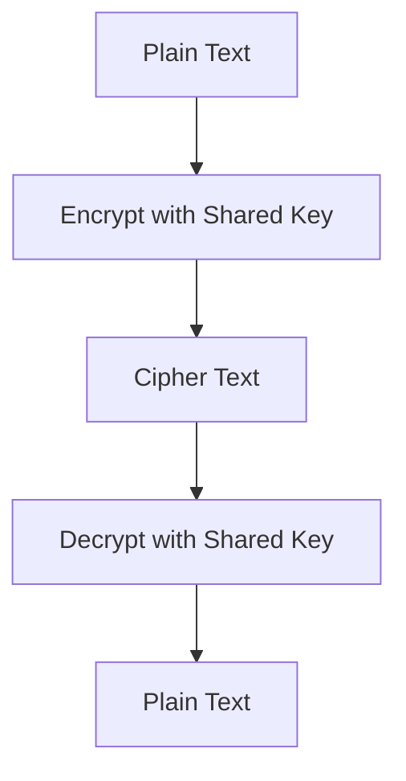
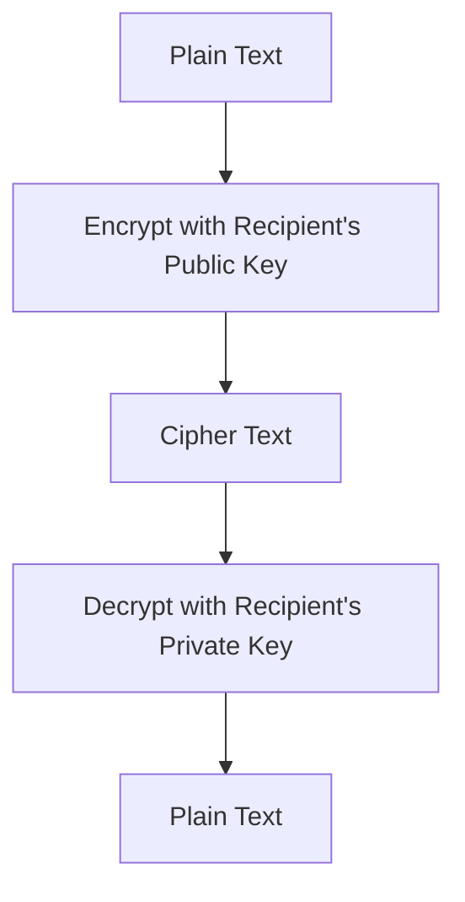
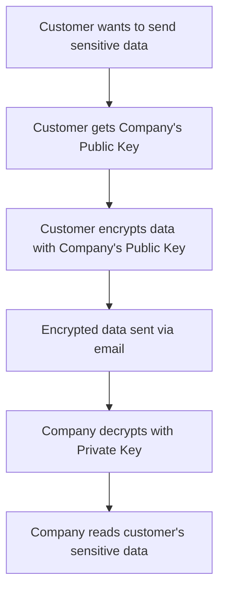
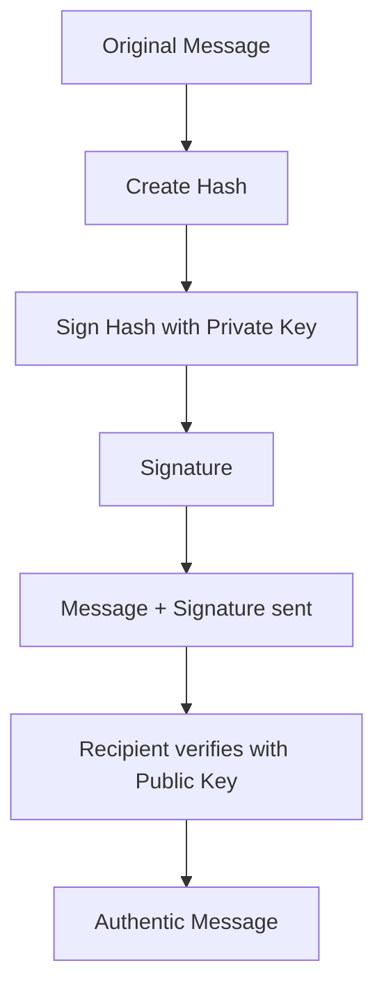

# Encryption

## Introduction

Encryption is the process of converting readable data (plaintext) into an unreadable format (ciphertext) to protect sensitive information from unauthorized access. This fundamental security technique ensures that even if data is intercepted, it cannot be understood without the proper decryption key. Encryption plays a crucial role in modern digital communications, protecting everything from personal emails to financial transactions and government communications.

## Basic Encryption Concepts

### Plain Text and Cipher Text
- **Plain text**: The original, readable message or data before encryption
- **Cipher text**: The encrypted, unreadable version of the data after encryption has been applied

### Encryption Keys
- **Public Key**: A cryptographic key that can be freely distributed and used by anyone to encrypt data
- **Private Key**: A secret cryptographic key known only to its owner, used for decryption
- **Encryption**: The process of converting plain text into cipher text using a cryptographic algorithm and key

## Symmetric Key Cryptography

Symmetric key cryptography, also known as secret key cryptography, uses the same key for both encryption and decryption. This method is fast and efficient for encrypting large amounts of data.

### How Symmetric Encryption Works
1. Both sender and receiver share the same secret key
2. The sender encrypts the plain text using the shared key
3. The encrypted cipher text is transmitted
4. The receiver decrypts the cipher text using the same shared key

### Example: AES Encryption

### Advantages of Symmetric Key Cryptography
- Very fast encryption/decryption speeds
- Efficient for large data volumes
- Lower computational requirements

### Disadvantages
- Key distribution problem: How to securely share the secret key?
- Each pair of users needs a unique key
- Not suitable for scenarios where public key exchange isn't feasible

## Asymmetric Key Cryptography

Asymmetric key cryptography, also known as public key cryptography, uses a pair of mathematically related keys: a public key for encryption and a private key for decryption.

### How Asymmetric Encryption Works
1. Each user generates a key pair (public key + private key)
2. Public keys are freely distributed
3. Private keys are kept secret
4. Anyone can encrypt data using someone's public key
5. Only the holder of the corresponding private key can decrypt the data

### Example: RSA Encryption Process

### Advantages of Asymmetric Key Cryptography
- No need for secure key exchange channels
- Enables secure communication between parties who have never met
- Supports digital signatures for authentication

### Disadvantages
- Slower than symmetric encryption
- Requires longer keys for equivalent security
- Higher computational requirements

## Private Messaging: Public to Individual/Organization

### Using Asymmetric Cryptography for Private Messages
When sending a private message from the public to an individual or organization:

1. **Sender obtains recipient's public key** (published openly)
2. **Sender encrypts message** using the recipient's public key
3. **Encrypted message is sent** through any channel (email, post, etc.)
4. **Only the recipient** can decrypt using their private key

### Example Scenario: Contacting a Company Securely

### Benefits
- Customer doesn't need Company's private key
- Message remains confidential even if intercepted
- Works without prior secure communication channel

## Verified Messaging: Individual to Public

### Using Digital Signatures for Message Verification
When sending a verified message from an individual to the public:

1. **Sender creates message** and generates hash
2. **Sender signs hash** using their private key
3. **Message + signature sent** to recipients
4. **Recipients verify signature** using sender's public key

### Digital Signature Process

### Benefits of Digital Signatures
- **Authentication**: Confirms sender's identity
- **Integrity**: Detects if message was tampered with
- **Non-repudiation**: Sender cannot deny sending the message

## Encryption and Decryption Processes

### Symmetric Encryption/Decryption
1. **Encryption**: Plain text + Secret Key → Cipher text
2. **Decryption**: Cipher text + Secret Key → Plain text
3. **Key requirement**: Same key used for both operations

### Asymmetric Encryption/Decryption
1. **Encryption**: Plain text + Public Key → Cipher text
2. **Decryption**: Cipher text + Private Key → Plain text
3. **Key requirement**: Public key for encryption, private key for decryption

### Hybrid Approach (Most Common)
Modern systems often combine both methods:

- Symmetric keys encrypt the actual data (fast)
- Asymmetric keys encrypt the symmetric keys (secure key exchange)
