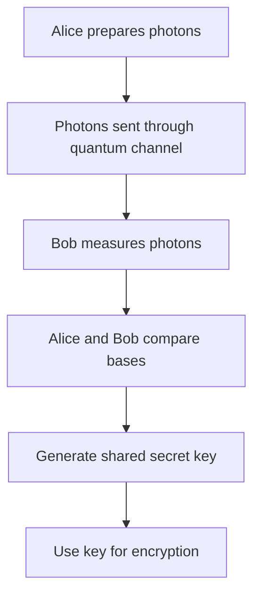

# Quantum Cryptography

## Introduction

Quantum cryptography represents a revolutionary approach to secure communications, leveraging the fundamental principles of quantum mechanics to provide theoretically unbreakable encryption. Unlike classical cryptography which relies on computational complexity, quantum cryptography is based on the laws of physics, making it immune to advances in computing power.

## Purpose

Quantum cryptography uses principles of quantum mechanics to provide theoretically unbreakable encryption through quantum key distribution (QKD). It ensures secure communication by detecting any eavesdropping attempts.

## How Quantum Key Distribution Works

1. **Photon transmission**: Sender (Alice) sends photons in quantum states
2. **Measurement**: Receiver (Bob) measures photons in random bases
3. **Key generation**: Alice and Bob compare bases to generate shared key
4. **Eavesdropping detection**: Any interception changes quantum states, alerting users

### Quantum Key Distribution Process

## Benefits of Quantum Cryptography

- **Theoretical security**: Based on laws of physics, not computational complexity
- **Eavesdropping detection**: Any interception attempt is immediately detectable
- **Future-proof**: Resistant to advances in computing power, including quantum computers
- **Perfect forward secrecy**: Keys are generated in real-time for each session

## Drawbacks of Quantum Cryptography

- **Limited range**: Currently works only over fiber optic cables (up to ~100km)
- **Expensive infrastructure**: Requires specialized quantum equipment
- **Low data rates**: Much slower than classical encryption methods
- **Point-to-point only**: Difficult to implement in complex network topologies
- **Vulnerable to side-channel attacks**: Physical security of equipment is critical
- **Not widely deployed**: Still emerging technology with limited real-world applications

## Current Status

While quantum cryptography offers unprecedented security guarantees, it remains a niche technology primarily used for high-security applications like government communications and financial transactions. Most internet communications still rely on classical encryption methods, with quantum-resistant algorithms being developed for future quantum computing threats.

## Future Implications

As quantum computing technology advances, quantum cryptography will become increasingly important for protecting sensitive data against quantum attacks. Research continues into satellite-based quantum networks and improved quantum repeaters to extend the range and practicality of quantum key distribution.