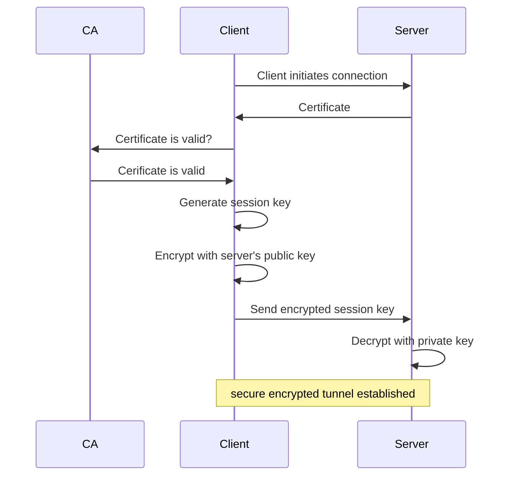

# Secure Socket Layer (SSL) / Transport Layer Security (TLS)

## Overview

**Secure Socket Layer (SSL)** and its successor **Transport Layer Security (TLS)** are cryptographic protocols designed to provide secure communication over computer networks. SSL was originally developed by Netscape in the 1990s, while TLS is the standardized version maintained by the Internet Engineering Task Force (IETF).

## Purpose of SSL/TLS

The primary purpose of SSL/TLS is to establish a secure, encrypted connection between a client (such as a web browser) and a server. This ensures:

- **Confidentiality**: Data transmitted between client and server is encrypted and cannot be read by unauthorized parties
- **Integrity**: Data cannot be modified during transmission without detection
- **Authentication**: Verifies the identity of the server (and optionally the client)
- **Non-repudiation**: Prevents either party from denying they sent or received data

## Use in Client-Server Communication

SSL/TLS operates at the transport layer of the network stack and is commonly used in:

### The TLS Handshake Process
1. **Client Hello**: Client initiates connection and asks the server to identify itself
2. **Server Hello**: Server responds with chosen cipher suite and digital certificate
3. **Authentication**: Client verifies server's certificate using a certificate authority
4. **Key Exchange**: If valid, the browser will use the public key contained in the certificate to encrypt a symmetric session key. The server decrypts the session key with its private key.
5. **Handshake Complete**: The shared session key can be used for all further communication establishing a secure encrypted tunnel.

### Simplified TLS Diagram

### Common Applications
- **HTTPS**: Secure web browsing (port 443)
- **Secure Email**: SMTPS, POP3S, IMAPS
- **VPN Connections**: Secure remote access
- **Secure FTP**: FTPS protocol

## Appropriate Situations for SSL/TLS

SSL/TLS should be used whenever sensitive data is being transmitted over potentially insecure networks:

### Essential Use Cases
- **E-commerce transactions**: Credit card details, personal information
- **Online banking**: Account credentials, financial data
- **Healthcare systems**: Patient records, medical data
- **Government services**: Citizen data, official communications

### Recommended Use Cases
- **Login pages**: Username/password authentication
- **Email servers**: Protecting message content and credentials
- **File transfers**: Sensitive documents, intellectual property
- **Remote desktop**: Administrative access to systems
- **API communications**: Web services exchanging sensitive data
