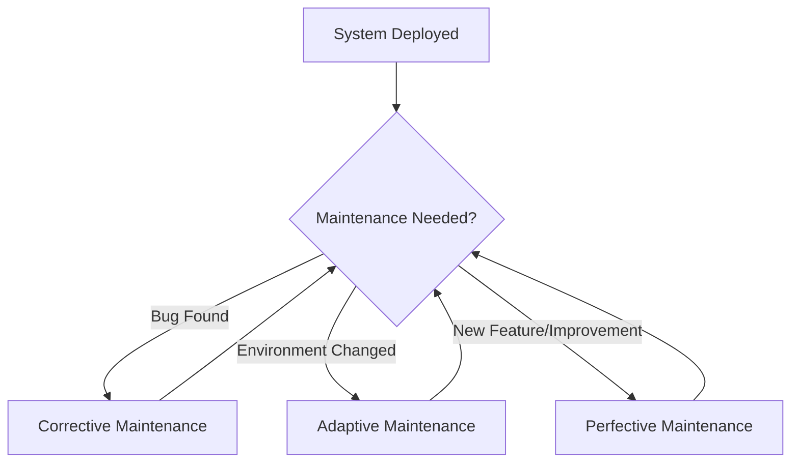

# Software Maintenance Guide

## Why Maintenance is Needed
Software does not stop evolving after it has been deployed.  

Even if a system works correctly at launch, ongoing maintenance is essential because:

- **Business requirements change** (e.g., new regulations, new features demanded by users).
- **Technology evolves** (e.g., new operating systems, updated libraries, security patches).
- **Errors are discovered** that were not found during testing.
- **Performance improvements** may be needed as usage grows.

Maintenance ensures that the system stays **reliable, secure, efficient, and useful**.

---

## Types of Maintenance


There are three main categories of software maintenance you need to understand:

### 1. Corrective Maintenance
- **Definition**: Fixing faults that appear after the system is in use.  
- **Examples**:
    - Resolving a crash that happens under certain conditions.
    - Correcting incorrect calculations or broken links.
- **Goal**: Restore the system to its intended functionality.

### 2. Adaptive Maintenance
- **Definition**: Updating the system so it continues to work in a changing environment.  
- **Examples**:
    - Modifying software to run on a new version of Windows or Android.
    - Updating database drivers when the DBMS is upgraded.
- **Goal**: Keep the system compatible with its environment.

### 3. Perfective Maintenance
- **Definition**: Enhancing or improving the system beyond its original requirements.  
- **Examples**:
    - Adding a new search feature to a website.
    - Optimising code to run faster.
    - Improving the user interface for usability.
- **Goal**: Improve performance, usability, or functionality.

---

## Example Case Study

Imagine a simple student grade calculator program:

```python
grades = [65, 72, 81, 90]

average = sum(grades) / len(grades)
print("Average grade is:", average)
```

Possible Maintenance:

- Corrective: Fix division by zero error if grades is empty.
- Adaptive: Modify to read grades from a CSV file instead of a fixed list.
- Perfective: Add functionality to display the highest and lowest grades.


## Key Takeaways

- Maintenance is not an optional extra; it is **an ongoing process**.  
- Different types of maintenance address different needs:  
    - **Corrective** → Fix errors.  
    - **Adaptive** → Ensure compatibility.  
    - **Perfective** → Improve functionality.  
- Analysing existing programs helps identify where each type of maintenance is needed.  
