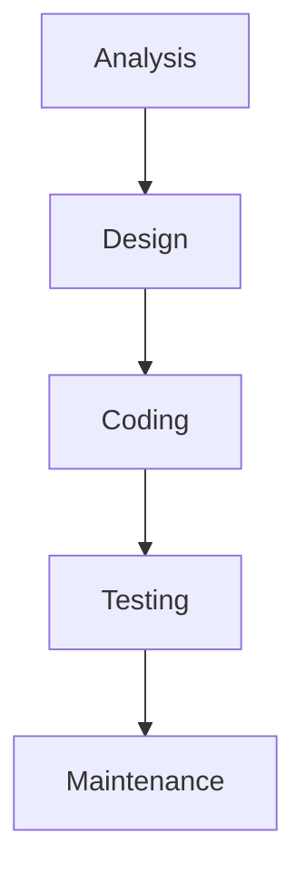
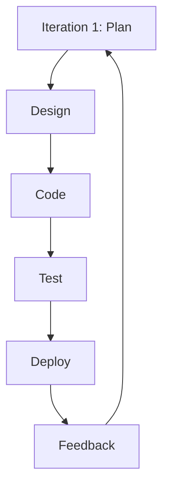
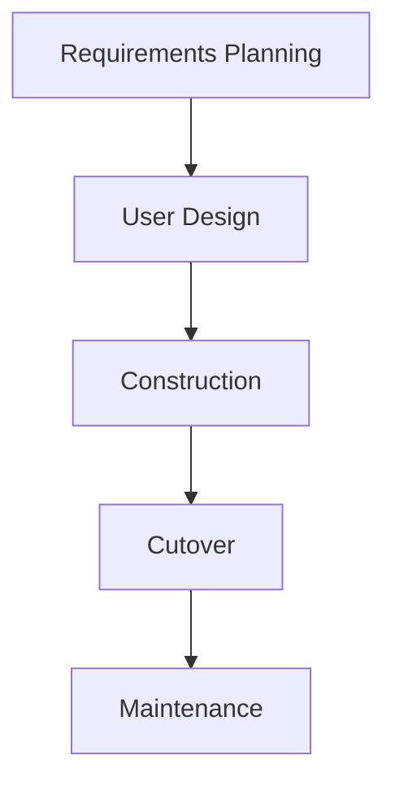

# 12.1 Program Development Life Cycle

## Purpose of a Development Life Cycle

The program development life cycle (PDLC) is a structured approach to software development that outlines the phases a project goes through from inception to completion and maintenance. Its primary purpose is to ensure that software is developed systematically, reducing risks, improving quality, and managing resources effectively. By following a life cycle, developers can identify requirements early, plan for changes, and deliver reliable software that meets user needs. It promotes collaboration among stakeholders, helps in estimating costs and timelines, and provides a framework for testing and validation to minimize errors in the final product.

## Stages of the Development Life Cycle

The typical stages of a PDLC include:

- **Analysis**: This stage involves gathering and analyzing requirements from stakeholders. Developers identify the problem, define objectives, and specify functional and non-functional requirements. The goal is to understand what the software needs to achieve and create a clear specification document.

- **Design**: Based on the analysis, the design phase creates a blueprint for the software. This includes architectural design (high-level structure), detailed design (algorithms, data structures), and user interface design. The output is design documents that guide implementation.

- **Coding**: In this phase, developers write the actual code based on the design specifications. They use programming languages and tools to implement the features. Best practices like code reviews and version control are employed to ensure quality.

- **Testing**: The software is rigorously tested to identify and fix bugs. This includes unit testing (individual components), integration testing (combined parts), system testing (entire system), and user acceptance testing (by end-users). The aim is to ensure the software meets requirements and is free from defects.

- **Maintenance**: After deployment, the software enters maintenance, where it is monitored, updated, and fixed as needed. This includes bug fixes, performance improvements, and adaptations to new requirements or environments.

## Different Life Cycle Models

Different projects may require different life cycle models based on factors like project size, complexity, requirements stability, and time constraints. Three common models are Waterfall, Iterative, and Rapid Application Development (RAD).

### Waterfall Model

#### Principles
The Waterfall model is a linear and sequential approach where each stage must be completed before moving to the next. It assumes that requirements are well-understood and stable from the start.

#### Benefits
- Simple and easy to understand and manage.
- Clear milestones and deliverables at each stage.
- Suitable for projects with well-defined requirements, such as in regulated industries.

#### Drawbacks
- Inflexible to changes; late requirement changes can be costly.
- Testing occurs late, potentially leading to major issues discovered too late.
- Not ideal for complex or innovative projects where requirements evolve.

#### Examples
- Developing a payroll system for a government agency where all requirements are predefined and regulatory compliance is critical.

#### When to Use
- Use when requirements are stable, well-documented, and unlikely to change throughout the project lifecycle.

#### Real-World Applications
- Aerospace software (e.g., flight control systems), military systems, and construction management software where predictability and documentation are paramount.

#### Comparisons
- Unlike Iterative and RAD models, Waterfall is less adaptable to changes but provides clear structure, predictability, and is ideal for projects with fixed scopes.

### Iterative Model

#### Principles
The Iterative model involves repeating cycles of development, where the software is built incrementally. Each iteration includes planning, design, coding, and testing, allowing for feedback and refinements in subsequent cycles.

#### Benefits
- Allows for early delivery of working software and user feedback.
- More flexible to accommodate changes in requirements.
- Reduces risk by addressing issues incrementally rather than all at once.

#### Drawbacks
- Can be less predictable in terms of timeline and cost if iterations are not well-managed.
- Requires strong project management to avoid scope creep.
- May lead to integration issues if iterations are not properly aligned.

#### Examples
- Building a web application where initial features are developed and user feedback is incorporated in subsequent iterations.

#### When to Use
- Use when requirements are expected to evolve, or when early delivery of a working product is valuable for gathering feedback.

#### Real-World Applications
- Agile software development in startups, mobile app development, and e-commerce platforms where market demands change rapidly.

#### Comparisons
- More flexible than Waterfall for handling changes, but requires better management than RAD; focuses on incremental improvements rather than rapid prototyping.

### Rapid Application Development (RAD)

#### Principles
RAD emphasizes rapid prototyping and iterative development with heavy user involvement. It focuses on quick delivery through tools and techniques that speed up development, such as reusable components and automated code generation.

#### Benefits
- Faster development and deployment, ideal for projects with tight deadlines.
- High user involvement ensures the product meets needs and reduces rework.
- Promotes reuse of components, improving efficiency.

#### Drawbacks
- Requires skilled developers and may not suit all project types.
- Can compromise quality if speed is prioritized over thorough testing.
- Dependent on clear user requirements; ambiguity can lead to failures.

#### Examples
- Developing a customer relationship management (CRM) system with rapid prototyping to validate user interfaces.

#### When to Use
- Use for projects with tight deadlines, clear user involvement, and where reusable components can accelerate development.

#### Real-World Applications
- Financial services software, retail point-of-sale systems, and business intelligence dashboards where quick deployment is essential.

#### Comparisons
- Faster than Waterfall and Iterative for initial delivery, but may sacrifice depth for speed; excels in user-centric projects compared to more rigid models.

