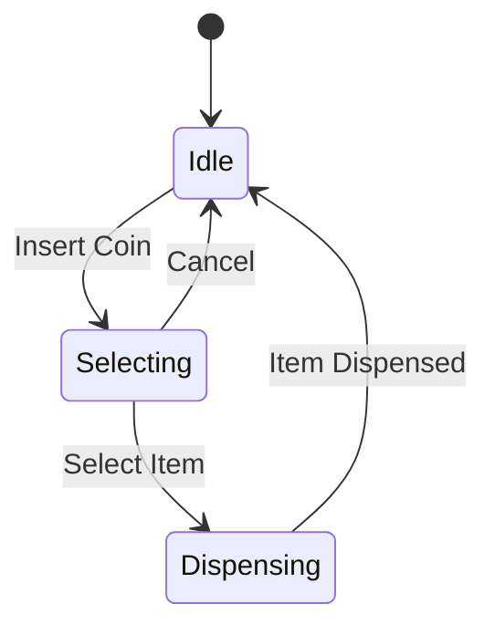

# State-Transition Diagrams 🔄

## Purpose of State-Transition Diagrams

State-transition diagrams (also known as state machines) are used to model the behavior of systems that change state based on events or conditions. In algorithm design, they help document how an algorithm transitions between different states, making it easier to understand complex logic, especially for interactive or event-driven programs. They show states as nodes and transitions as arrows with labels for triggers and actions. 📈

## Example: Vending Machine 🛒

This diagram shows the states of a vending machine and how it transitions based on user actions. Each state represents a condition, and transitions occur based on events like inserting a coin or selecting an item. 💰