# Testing in Software Development 🧪

## Exposing and Avoiding Faults in Programs
Understanding how to **expose** and **avoid faults** is crucial for developing reliable software.  

**Faults (bugs)** can be exposed through:

  - Systematic testing
  - Code reviews
  - Debugging techniques  

To **avoid faults**, developers should follow best practices such as:

  - Writing clear, modular code
  - Using version control
  - Conducting peer reviews
  - Performing regular code inspections
  - Using automated tools to catch potential issues early  

👉 Effective prevention reduces the likelihood of faults propagating into production.

---

## Types of Errors 🐛
Programs can contain different types of errors, each with distinct characteristics and impacts.  
Identifying these errors is the **first step toward correction**.

**Syntax Errors**

  - Occur when code violates the rules of the programming language.  
  - Example: missing semicolons, incorrect indentation.  
  - Usually detected by the compiler or interpreter before execution.  

**Logic Errors** 

  - Code executes without crashing but produces incorrect results.  
  - Caused by flawed reasoning in the algorithm.  
  - Harder to detect; require careful testing and tracing.  

**Run-time Errors**  

  - Happen during execution, often due to invalid operations.  
  - Example: dividing by zero, accessing out-of-bounds memory.  
  - Can cause crashes or unpredictable behavior.  

---

## Correcting Identified Errors
Once errors are identified, correction involves **debugging and fixing the root cause**:  

- **Syntax errors** → Review against language rules and adjust.  
- **Logic errors** → Trace program flow (using debuggers or print statements).  
- **Run-time errors** → Add input validation or exception handling.  

✅ After correction, **re-test** to confirm the issue is resolved and no new problems were introduced.

---

## Testing Methods 🧪
Different testing methods validate software functionality and reliability.  
Each method requires **appropriate test data** to cover scenarios effectively.  

### Common Testing Approaches
- **Dry Run** → Manually simulate program execution.  
- **Walkthrough** → Team reviews code step-by-step.  
- **White-box Testing** → Examines internal code structure (all paths/branches).  
- **Black-box Testing** → Focuses on inputs/outputs, no code knowledge required.  
- **Integration Testing** → Tests module interactions with combined data.  
- **Alpha Testing** → Done by developers in controlled environment.  
- **Beta Testing** → Done by external users in real-world conditions.  
- **Acceptance Testing** → Verifies software meets user requirements.  
- **Stub Testing** → Uses placeholders for incomplete modules.  

## White-box vs Black-box Testing

### White-box Testing 🔍
- **Definition**: Testing that examines the *internal structure* and logic of the code.  
- **Tester Knowledge**: Requires access to source code.  
- **Focus**: Ensures all paths, branches, and conditions are tested.  
- **Examples**: Unit tests, branch coverage, path testing.  
- **Advantages**:
    - Detects hidden errors in code structure.
    - Helps optimise performance by finding inefficient logic.
- **Disadvantages**:
    - Requires programming knowledge.
    - Can be time-consuming to achieve full coverage.

### Black-box Testing 🎭
- **Definition**: Testing that focuses only on *inputs and outputs*, without knowing how the code works internally.  
- **Tester Knowledge**: No access to source code required.  
- **Focus**: Validates whether the software meets functional requirements.  
- **Examples**: System testing, acceptance testing, UI testing.  
- **Advantages**:
    - Tests from the user’s perspective.
    - Can be done without programming expertise.
- **Disadvantages**:
    - Limited in detecting hidden code issues.
    - May require many test cases to cover all scenarios.

---

### Visual Comparison

```mermaid
flowchart LR
    A[White-box Testing 🔍] --> B[Tests internal code structure]
    A --> C[Requires source code access]
    A --> D[Focus: paths, branches, logic]

    E[Black-box Testing 🎭] --> F[Tests inputs and outputs]
    E --> G[No source code needed]
    E --> H[Focus: functionality and user perspective]
```

## Test Strategy and Test Plan

**Test Strategy** → High-level approach to testing:

  - Goals  
  - Scope  
  - Resources  

**Test Plan** → Specific steps to execute tests:

  - Timelines  
  - Responsibilities  
  - Environments  
  - Risk assessments  
  - Success criteria  

📌 Together, they ensure **systematic coverage and efficiency**.

---

## Choosing Appropriate Test Data

Selecting the right test data is essential for **thorough testing**.  

- **Normal Data** → Typical, expected inputs. Ensures core functionality works.  
- **Abnormal Data** → Invalid/unexpected inputs. Tests error handling and robustness.  
- **Extreme/Boundary Data** → Edge cases (min/max values). Checks how the program behaves at limits.  
