# 🔌 Ethernet and Collision Management in Networks

Ethernet is one of the most common ways of connecting devices in a **wired LAN**. But when lots of devices are trying to send data at once, they can crash into each other! 💥

Let’s explore how **collisions happen** and how they’re **handled and avoided**.

---

## 🧵 What is Ethernet?

- A **networking standard** for connecting devices using cables (typically Cat5 or Cat6).
- Uses **frames** (like envelopes) to send data.
- Devices share the same communication medium (e.g., a cable).

Think of Ethernet like a **shared road** — cars (data) must avoid crashing into each other! 🚗🛣️

---

## 💥 What is a Collision?

- A **collision** happens when **two or more devices** send data on the network **at the same time**.
- Their signals interfere and become **corrupted**.
- The data has to be **sent again**, which wastes time and bandwidth.

---

## 🧠 How Does Ethernet Handle Collisions?

###  It uses **CSMA/CD**:
**Carrier Sense Multiple Access / Collision Detection**

Here’s how it works:

1. **Carrier Sense (CS)** 👂  
   A device **listens** to the cable to see if it’s free (no one else is sending).

2. **Multiple Access (MA)** 👫  
   All devices share the same cable and have equal rights to transmit.

3. **Collision Detection (CD)** 💥  
   If two devices send at the same time, they detect the collision.

4. **Jam Signal** 🚨  
   A special message is sent to warn others: “⚠️ There was a collision!”

5. **Backoff Time** ⏲️  
   Each device waits a **random time** before trying again. This reduces the chance of another collision.

---

## 🔄 The Cycle of CSMA/CD

```mermaid 
flowchart TD 
  A[Start] --> B{Is cable free?} 
  B -- Yes --> C[Send data] 
  C --> D{Collision?} 
  D -- No --> E[Success ✅] 
  D -- Yes --> F[Send jam signal 🚨] 
  F --> G[Wait random time ⏱️] 
  G --> A 
```

---

## 🚫 Why Isn’t CSMA/CD Used in Modern Networks?

- Most modern Ethernet uses **switches**, not hubs.
- Switches create a **separate channel** for each connection — no shared cable, so **no collisions**!
- CSMA/CD is still important to understand for **legacy systems** and **network theory**.

---

## 📌 Key Points to Remember

- **Ethernet** is the wired communication standard for LANs.
- **Collisions** happen when multiple devices send data at once.
- **CSMA/CD** is the method Ethernet uses to:
  - Detect collisions 💥
  - Send a jam signal 🚨
  - Retry after waiting ⏱️
- Modern switched networks **avoid collisions entirely**!

---

🚦 Just like traffic lights control cars on a road, CSMA/CD controls data on an Ethernet cable. No crashes, just smooth communication! 🛣️📦✨

