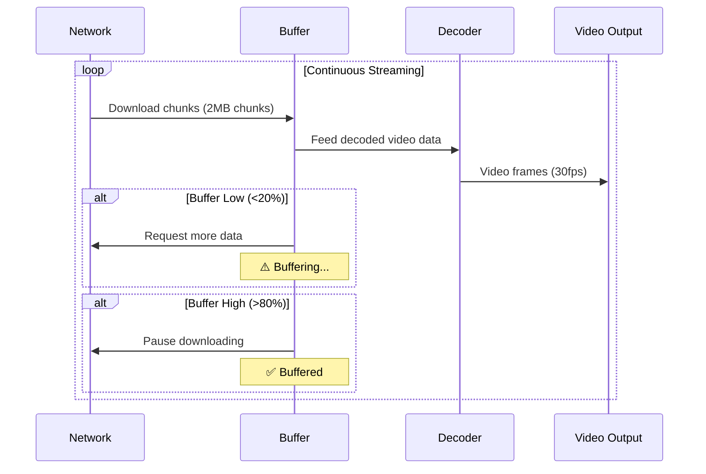

# Buffers in Hardware

## Introduction

Buffers are temporary storage areas used to manage data flow between devices or processes that operate at different speeds or timings. They prevent data loss and ensure smooth operation.

## Buffer Management in Media Player

## Purpose of Buffers

- **Data Synchronization**: Accommodate differences in data transfer rates between components (e.g., CPU and I/O devices).
- **Error Prevention**: Avoid overflow or underflow by holding data temporarily.
- **Efficiency**: Allow asynchronous operations, improving overall system performance.

## Types of Buffers

- **Hardware Buffers**: Physical memory areas in devices like keyboards (key buffer) or printers (print buffer).
- **Software Buffers**: Memory allocated by the operating system or applications for data queuing.

## Examples

- **Keyboard Buffer**: Stores keystrokes until the CPU can process them, allowing continuous typing.
- **Video Buffer (Frame Buffer)**: Holds pixel data for display, enabling smooth rendering.
- **Network Buffer**: Manages incoming/outgoing packets to handle variable network speeds.

## Importance

Buffers are crucial in real-time systems and multimedia applications where timing is critical, ensuring data integrity and user experience.
