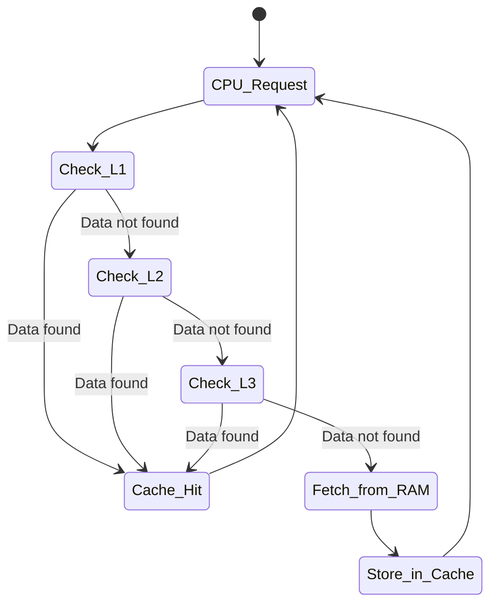

# Cache Memory

...

---
## Cache?

+ **==Cache==** memory is a high-speed, temporary storage area that stores frequently accessed data and instructions. 
+ It acts as a bridge between the CPU and main memory (RAM), reducing access times and enhancing overall system efficiency. 🚀

---

---

#### Types of Cache:

  - **L1 Cache**: Smallest and fastest, integrated into the CPU core. Divided into instruction cache and data cache.
  - **L2 Cache**: Larger than L1, can be on-chip or off-chip. Shared between CPU cores.
  - **L3 Cache**: Largest level, shared among all CPU cores on multi-core processors.

---
## State Transition Diagram

---
#### Cache Characteristics

  + Extremely fast access times (nanoseconds).
  + Volatile memory - data is lost when power is off.
  + Smaller capacity compared to RAM.
  + Uses **SRAM** technology for speed.
  + Located on the CPU chip or nearby.

---
#### How Cache Works

Cache operates on the principle of locality:

- ==**Temporal Locality**==: Recently accessed data is likely to be accessed again soon.
- ==**Spatial Locality**==: Data near recently accessed data is likely to be accessed soon.

---
#### Cache hits and misses
When the CPU requests data:

+ Check L1 cache first.
+ If not found, check L2, then L3.
+ If not in cache (cache miss), fetch from RAM.
+ Store the fetched data in cache for future use.

---

+ **Cache Hit**: Data found in cache - fast access! ✅
+ **Cache Miss**: Data not in cache - slower access from RAM. ❌

---
## Key Benefits 🌟

| Benefit        | Description                                                       |
| -------------- | ----------------------------------------------------------------- |
| Speed          | Dramatically faster than RAM access                               |
| Efficiency     | Reduces CPU wait times                                            |
| Performance    | Improves overall system responsiveness                            |
| Cost-Effective | Small size keeps costs down while providing big performance gains |

---

Cache memory is essential for modern computing, making systems feel snappier and more responsive! ⚡
