# Embedded Systems

An embedded system is a microprocessor within a **larger system** used to perform a **dedicated function**. For example, domestic appliances, cars, security systems, lighting systems, or vending machines are all considered embedded systems.

This is different from a **general-purpose** computer that is used to perform many different functions, such as a personal computer (PC) or a laptop.

## Applications

Embedded systems are ubiquitous in modern technology. Common applications include:

- **Consumer Electronics**: Smartphones, smart TVs, gaming consoles.
- **Automotive**: Engine control units, infotainment systems, autonomous driving.
- **Medical Devices**: Pacemakers, insulin pumps, MRI machines.
- **Industrial Automation**: Robotics, PLCs (Programmable Logic Controllers).
- **Home Automation**: Smart thermostats, security systems.

### Mind Map

```mermaid
mindmap
  root((Embedded Systems Applications))
    Consumer Electronics
      📱 Smartphones
        Mobile OS Integration
        Sensor Fusion
      🕶️ Wearables
        Smartwatches
        Fitness Trackers
    Automotive Systems
      🛡️ ABS
        Crash Prevention
        Vehicle Stability
      🗺️ GPS Navigation
        Real-time Routing
        Telematics
    Medical Devices
      🏥 Patient Monitors
        Vital Signs Tracking
        Remote Monitoring
      💉 Implants
        Pacemakers
        Neural Interfaces
    Industrial Automation
      🤖 Robotics
        Motion Control
        AI Integration
      📡 Sensors
        IoT Connectivity
        Predictive Maintenance
```

## Benefits of Embedded Systems

- **Low Power Consumption**: Designed for efficiency, they consume minimal power, making them ideal for battery-operated devices.
- **Reliability**: Dedicated hardware and software reduce the risk of crashes and improve overall system stability.
- **Cost-Effectiveness**: Mass production and specialized components keep costs low.
- **Real-Time Operation**: Capable of responding to inputs instantly, crucial for applications like automotive control or medical devices.
- **Compact Size**: Small form factor allows integration into constrained spaces.

## Drawbacks of Embedded Systems

- **Limited Processing Power**: Often use low-power processors, which may not handle complex computations.
- **Difficulty in Updates**: Firmware updates can be challenging and may require specialized tools or physical access.
- **Task-Specific Design**: Not easily adaptable to new functions without redesigning the hardware and software.
- **Debugging Challenges**: Limited interfaces make troubleshooting difficult.
- **Security Risks**: If compromised, embedded systems can be hard to patch due to their isolated nature.

## RAM and ROM in Embedded Systems

In embedded systems, memory plays a critical role in storing data and instructions. The two primary types of memory are RAM (Random Access Memory) and ROM (Read-Only Memory), each serving distinct purposes. 

RAM is volatile memory used for temporary storage of data that the embedded system needs to access and modify quickly during operation. It allows the processor to read and write data rapidly but loses all stored information when power is disconnected. ROM is non-volatile memory that permanently stores data, even without power. It is typically used to hold the firmware, boot code, or operating system instructions that define the embedded system's core functionality.

### Example: Washing Machine
A modern washing machine incorporates an embedded system to manage wash cycles, water levels, spin speeds, and connectivity features. **What information would RAM store? And what would ROM store?**

| RAM | ROM |
|-----|-----|
| Current water level sensor readings | Firmware |
| Selected wash program settings | Control algorithms for motor speeds |
| Cycle progress | Control algorithms for water valves |
| Time left in cycle | Control algorithms for detergent dispensing |

By leveraging both RAM for dynamic operations and ROM for persistent instructions, the washing machine's embedded system operates efficiently and reliably, executing precise wash cycles while supporting smart features like remote control and diagnostics.