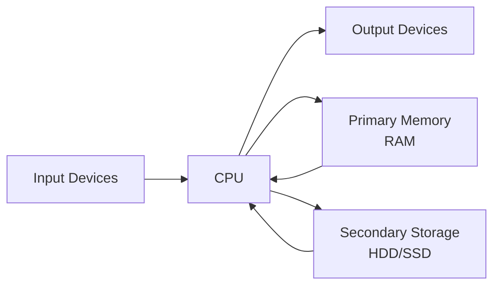

# Input, Output, Primary Memory, and Secondary Storage

## Input Devices

Input devices allow users and systems to provide data to the computer.

- **Purpose**: To capture data from the external environment and convert it into a form the computer can process.
- **Examples**: Keyboards, mice, scanners, microphones, sensors.
- **Importance**: Without input devices, computers cannot receive instructions or data, rendering them useless for interactive tasks.

## Output Devices

Output devices display or convey processed information to users or other systems.

- **Purpose**: To present results of computations in a human-readable or machine-readable format.
- **Examples**: Monitors, printers, speakers, actuators.
- **Importance**: Enables communication of processed data, feedback, and control signals.

## Primary Memory

Primary memory, also known as main memory or RAM, is the computer's short-term memory.

- **Purpose**: Temporarily stores data and instructions currently being used by the CPU for fast access.
- **Characteristics**: Volatile (data lost on power off), high speed, limited capacity.
- **Importance**: Essential for running programs and multitasking; without it, the CPU cannot access data quickly.

## Secondary Storage

Secondary storage provides long-term, non-volatile storage for data and programs.

- **Purpose**: To store large amounts of data permanently, even when the computer is powered off.
- **Examples**: Hard disk drives (HDD), solid-state drives (SSD), optical discs (CD/DVD), USB flash drives.
- **Including Removable Storage**: Devices like USB drives, SD cards, and external HDDs that can be easily detached and moved between systems.
- **Importance**: Allows data persistence, program installation, and backup; complements primary memory by providing larger capacity at lower cost.