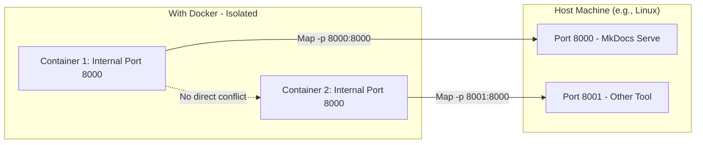

# Why Docker Containers Help with Port Conflicts in Local Server Management

Docker is a popular containerization platform that allows you to package applications and their dependencies into lightweight, portable **containers**. These containers run in isolated environments on your host machine (e.g., your Linux system), behaving like mini-virtual machines but with much less overhead. In the context of local server management—especially for development workflows like running MkDocs or other web servers—Docker excels at preventing and resolving port conflicts.

## Understanding Port Conflicts in Traditional Local Development 🚫

Without containerization, when you run a local server (e.g., `mkdocs serve` on port 8000), it binds directly to the host machine's network interface. If another process (like a previous server instance or a different tool) is already using that port, you get the "address already in use" error.

This is because the host OS manages ports globally: only one process can bind to a specific port (e.g., TCP port 8000 on localhost) at a time. Conflicts arise from poor hygiene, multiple projects, or lingering processes.

## How Docker Containers Isolate and Manage Ports 🔒

- **Isolation via Network Namespaces**: Each Docker container runs in its own isolated network namespace. This means:
  - Inside the container, the application (e.g., your MkDocs server) can bind to any port (like 8000) without affecting the host or other containers. Ports are "virtual" within the container's scope—conflicts only happen if two containers try to bind to the same internal port **and** map it to the same host port.
  - The container's network is separate from the host's, so even if you have 10 containers all running services on internal port 8000, they won't conflict with each other or the host unless you explicitly map them to the same host port.

- **Explicit Port Mapping (Port Binding)**: Docker doesn't automatically expose container ports to the host; you control this with the `-p` (publish) flag or in a `docker-compose.yml` file. For example:
  - Run a container with: `docker run -p 8000:8000 my-mkdocs-image`
    - This maps the container's internal port 8000 to the host's port 8000. If host port 8000 is free, it works; if not, Docker reports an error, but you can choose a different host port like `-p 8001:8000` (host:8001 → container:8000).
  - This explicit mapping prevents accidental conflicts: You decide which host ports are used, making it predictable and avoiding "random" port assignments.

- **No Shared Dependencies or State**: Containers bundle everything (code, runtime, libraries like Python for MkDocs), so you can't have overlapping processes from different projects accidentally using the same port. Each container starts fresh, and stopping one doesn't affect others.

## Specific Benefits for Resolving Port Conflicts ✅

- **Eliminates Global Port Competition**: Unlike running multiple servers directly on the host (e.g., one MkDocs on 8000, another tool on 8000), containers allow multiple services to "think" they're on port 8000 internally while mapping to unique host ports (e.g., 8000, 8001, 8002). This is ideal for multi-project setups, as mentioned in the guide's "Use a Consistent Port Range or Specific Ports" practice.
- **Easy Cleanup and Restart**: Containers are ephemeral—use `docker stop <container_id>` to shut them down cleanly, freeing mapped ports immediately. No need for `kill` commands or checking PIDs with `lsof`. For hygiene, you can script starts/stops or use `docker-compose up/down` to manage entire stacks.
- **Consistency Across Environments**: Port configurations are defined in Dockerfiles or compose files, so your setup works the same on any machine (dev laptop, CI/CD, production). This reduces "it works on my machine" issues caused by port mismatches.
- **Scalability for Complex Projects**: For projects with multiple services (e.g., a frontend server on 3000 + backend on 5000), Docker networks let services communicate internally without exposing all ports to the host, further reducing exposure to conflicts.
- **Resource Efficiency**: Containers share the host kernel but isolate networking, so they're lighter than full VMs while providing the isolation needed to avoid port issues.

## Potential Drawbacks and When to Use It ⚠️

- **Learning Curve**: If you're new to Docker, there's an initial setup (install Docker, create a Dockerfile for your MkDocs project). But for simple cases like MkDocs, it's straightforward—e.g., build an image with your docs and run it as a server.
- **Overhead for Simple Tasks**: For a single MkDocs site, direct `mkdocs serve` might suffice with the hygiene practices in the guide. Docker shines for multiple/interconnected projects or team collaboration.
- **Host Port Still Matters**: You can't map two containers to the same host port, but Docker's error messages are clear, and you can dynamically assign ports (e.g., via environment variables).

## Example: Dockerizing Your MkDocs Setup to Avoid Conflicts 📝

To illustrate, here's how you might containerize your MkDocs project:

- **Dockerfile** (in your project root):
  ```
  FROM python:3.9-slim
  WORKDIR /docs
  COPY . .
  RUN pip install mkdocs mkdocs-material  # Or from requirements.txt
  EXPOSE 8000
  CMD ["mkdocs", "serve", "-a", "0.0.0.0:8000"]
  ```

- **Build and Run**:
  ```
  docker build -t my-mkdocs .
  docker run -p 8001:8000 my-mkdocs  # Maps host 8001 to container 8000
  ```
  - If 8001 is taken, try 8002—no conflict inside the container.
  - Access at `http://localhost:8001`. Stop with `docker stop <container_id>`.

## Visualization: Port Mapping in Docker 📊



In summary, Docker containers help with port conflicts by providing network isolation and explicit control over host mappings, turning a chaotic shared environment into a predictable, conflict-free one. For hands-on setup, refer to the [official Docker docs](https://docs.docker.com/get-started/) or integrate it into your project's README.
