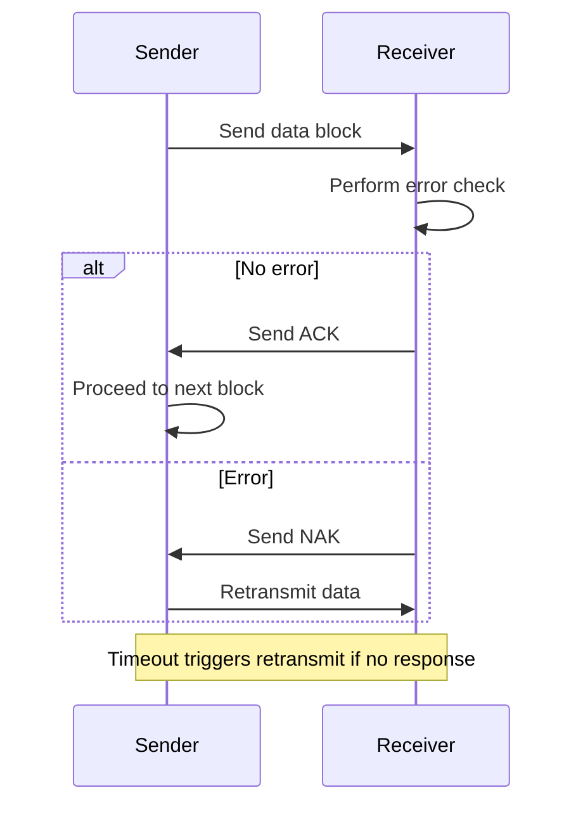

#### Automatic Repeat Query (ARQ) 🔄

**ARQ** is a system used to ensure data is received without error by automatically requesting a re-send if an error is detected. It combines error detection with a feedback system.

**Process**:

1.  The sender transmits a block of data.
2.  The receiver performs an error check (like a parity check or checksum).
3.  If no error is found, the receiver sends a **positive acknowledgment (ACK)** message back to the sender. This tells the sender that the data was received correctly and they can send the next block.
4.  If an error is found, the receiver sends a **negative acknowledgment (NAK)** message. This tells the sender that an error occurred and they must **retransmit** the data.
5.  A **timeout** is used as a safety measure. If the sender doesn't receive an ACK or NAK within a set time, it automatically assumes the data was lost and retransmits it.

### ARQ Process Diagram

This process ensures reliable data transfer even with transmission errors.