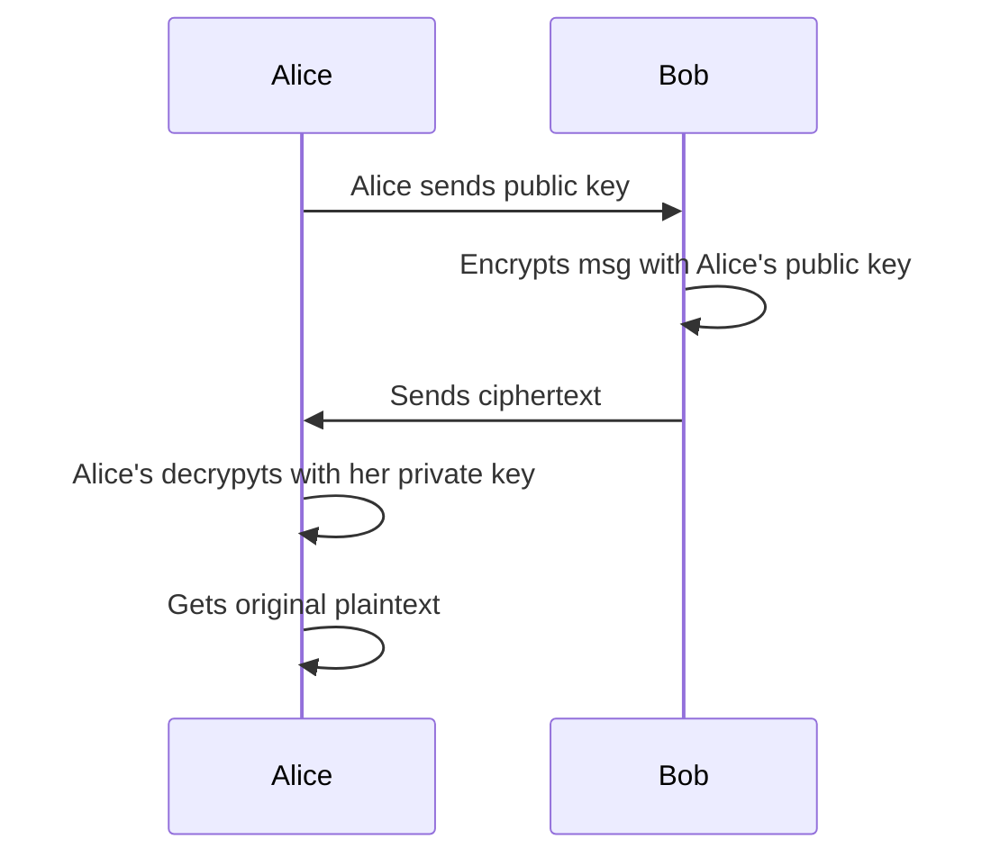

### Asymmetric Encryption ➡️⬅️

This method, also known as **public-key cryptography**, is more complex but more secure. It uses a **pair of mathematically linked keys**: a **public key** and a **private key**.

-   **Public key**: This key can be shared with anyone. Its purpose is to **encrypt** data.
-   **Private key**: This key must be kept secret and only known to its owner. Its purpose is to **decrypt** data that was encrypted with the corresponding public key.

**How it works**:

1. The receiver generates a public key and a private key. 
2. They keep the private key secret
3. They share the public key with the sender
4. The sender uses the **public key** to encrypt the data.
5. The sender transmits the ciphertext.
6. The receiver uses their own **private key** to decrypt the ciphertext back into plaintext. 
7. Only the pricate key can be used to decrypt the message.

**Analogy**: You have an open mailbox (your public key) that anyone can drop a message into. Once a message is inside, only you, with your mailbox key (your private key), can open and read it.

**Benefit**: It's highly **secure** because the private key is never transmitted.

**Drawback**: It's significantly **slower** than symmetric encryption. For this reason, it's often used to securely exchange a secret key for a symmetric encryption session.

Both methods are essential for protecting data in transit, and they often work together to provide a robust security solution. 🌐🔒

### Asymmetric Encryption Process

