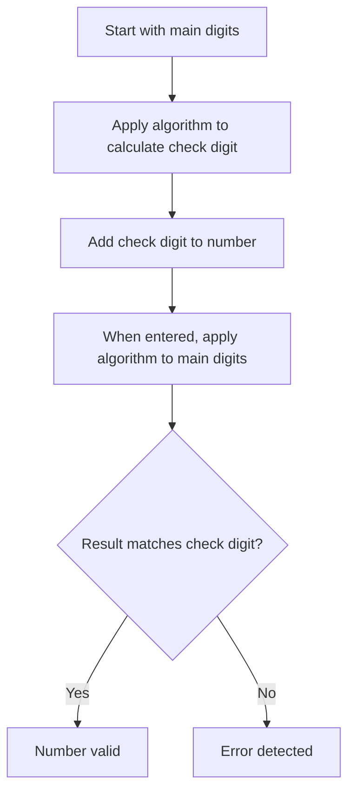

#### Check Digit 🔢

A **check digit** is a single digit added to a series of numbers to detect errors in **data entry**. It's not typically used for transmission errors but for mistakes made when a person types in a number.

**Process**:

1.  A mathematical algorithm is applied to the main sequence of digits.
2.  The result of this calculation is the check digit.
3.  The check digit is added to the end of the number.
4.  When the number is entered, the same algorithm is applied to the main digits.
5.  If the result matches the check digit, the number is considered valid.

### Check Digit Flowchart

**Examples**:

-   **International Standard Book Numbers (ISBN)**: The last digit of a 10 or 13-digit ISBN is a check digit.
-   **Bar Codes**: The last digit of a bar code is a check digit.
-   **Product codes** and **bank account numbers** also often use check digits.