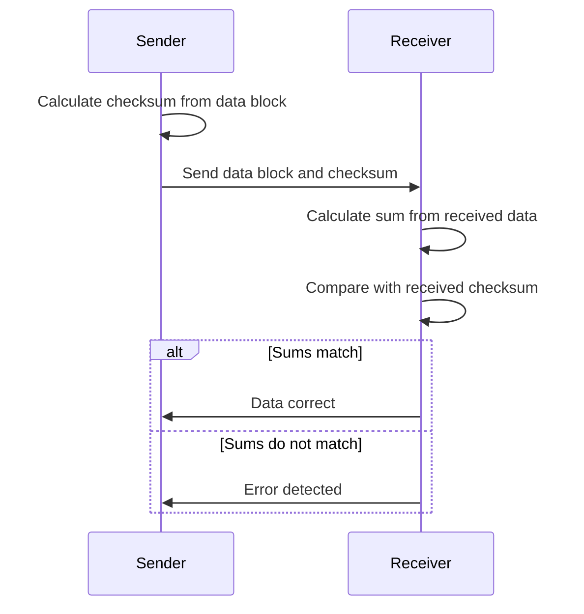

#### Checksum ✅

This method works with a block of data rather than just a single byte.

**Process**:

1.  The sender adds up all the numerical values of the bytes in a block of data.
2.  The resulting sum is called the **checksum**.
3.  The checksum is transmitted along with the data block.
4.  The receiver also adds up the values of the bytes in the received block.
5.  If the receiver's sum matches the transmitted checksum, the data is likely correct. If they don't match, an error is detected.

### Checksum Process Diagram

