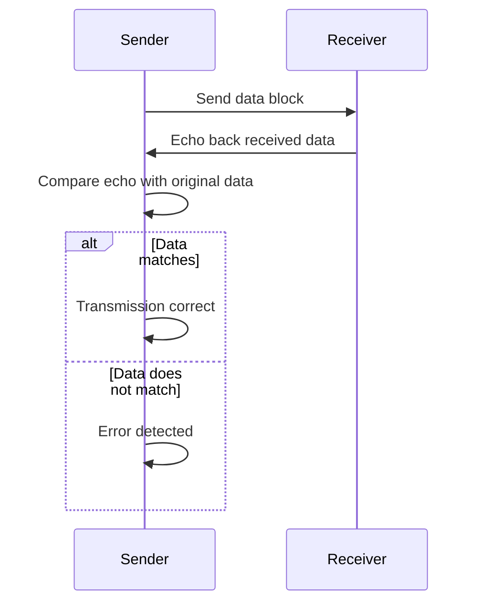

#### Echo Check 🗣️

This is a simple, yet effective method where the receiver of the data immediately sends the received data back to the sender.

**Process**:

1.  The sender transmits a block of data.
2.  The receiver receives the data and, without processing it, **echos** (sends) it back to the sender.
3.  The sender then compares the received data (the echo) with the original data they sent.
4.  If the two match, it's assumed the data was transmitted correctly. If not, an error is detected.

### Echo Check Process Diagram

