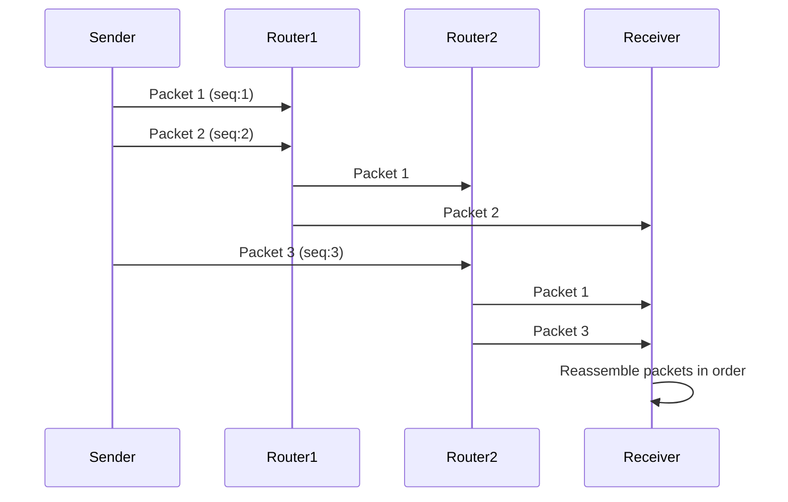

### Data Transmission 🌐
Let's dive into how data travels from one place to another. 🚀
***

### Packet Switching 📦

Think of data like a big book you want to send to a friend. Instead of sending the whole book at once, you tear it into individual pages, put each page in a separate envelope, and label them with the correct addresses and page numbers. This is exactly what happens with data! The data is **broken down into packets** to be transmitted.

#### What's a Packet? ✉️

A packet is like a little digital envelope containing a piece of the original data. It has three main parts:

- **Packet Header** 🗺️: This is like the envelope's front. It includes the **destination address** (where the packet is going), the **packet number** (so it can be put back in the right order), and the **originator's address** (where it came from).
- **Payload** 🚚: This is the actual data—the piece of the book page inside the envelope.
- **Trailer** ✅: This is like a special section at the end that helps check if the data arrived correctly.

#### The Process of Packet Switching 🔄

Once the data is split into packets, a cool thing happens:

1.  **Breaking it down**: The data is chopped into many small packets.
2.  **Taking different routes**: Each packet could take a different route through the network, guided by devices called **routers**. A router is like a traffic cop for data, controlling the route a packet takes to avoid congestion.
3.  **Arriving out of order**: Since each packet might take a different route, they may arrive at their destination out of order.
4.  **Reordering**: Once the last packet has arrived, the computer uses the packet numbers to reorder them and put the data back together.

### Packet Switching Diagram

This method is super efficient and reliable because if one packet gets lost, only that small piece needs to be resent, not the whole thing!