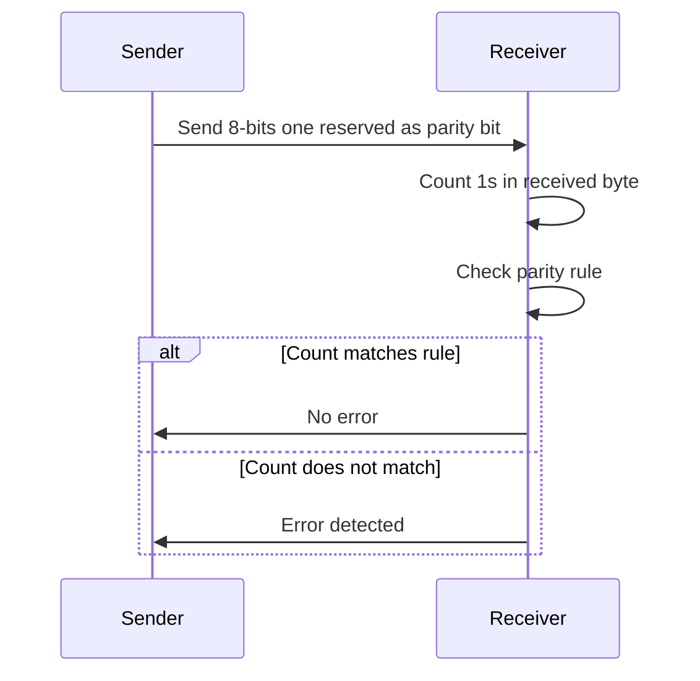

#### Parity Check 🔢

This is a simple way to check for errors in a single byte of data. A **parity bit** is a bit **reserved within a byte (8 bits)** of data. The value of this bit (0 or 1) is determined by the number of 1s in the other seven bits.

-   **Even Parity**: The parity bit is set so that the total number of 1s in the **8-bit word** is **even**.
-   **Odd Parity**: The parity bit is set so that the total number of 1s in the **8-bit word** is **odd**.

**Process**:

1.  The sender counts the number of 1s in the seven data bits.
2.  Based on the chosen parity (even or odd), they set the parity bit.
3.  The **8-bit word** is transmitted.
4.  The receiver counts the 1s in the received word.
5.  If the count matches the parity rule, no error is detected. If it doesn't, an error is flagged.

This method can also be extended to a **parity block check**, where a parity bit is calculated for each row and column of a block of data, forming a **parity byte** which is transmitted with the data block. This allows for the detection of more complex errors.

### Parity Check Process Diagram

