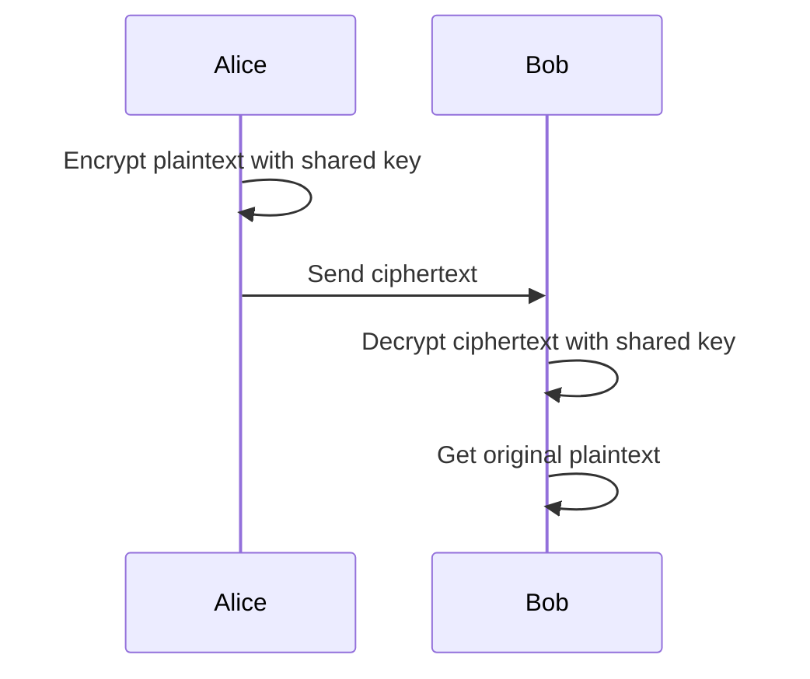

### Encryption 🔐
Hello again! Let's talk about the super important topic of **encryption**, which is like a secret code for your data. 🤫

***

### The Purpose of Encryption 🛡️

When you send data over the internet, it travels through many different places. If the data isn't protected, anyone who intercepts it could read it. This is where encryption comes in.

**Encryption is the process of converting data (plaintext) into a secret code (ciphertext)**. This makes the data unreadable to anyone who doesn't have the key to decrypt it. The primary **purpose of encryption** is to ensure **confidentiality** and **security** when transmitting data. It protects your personal information, like bank details or passwords, from hackers and other malicious users.

***

### Symmetric Encryption ↔️

This is the older and simpler method. It uses **the same single key** to both encrypt and decrypt the data. Think of it like a padlock where both you and the recipient have an identical key.

**How it works**:
1.  The sender uses a **shared secret key** to encrypt the plaintext data into ciphertext.
2.  The sender transmits the ciphertext to the receiver.
3.  The receiver uses the **exact same key** to decrypt the ciphertext back into readable plaintext.

### Symmetric Encryption Process

**Analogy**: Imagine you and a friend have the only two keys to a special lockbox. You put a message in the box, lock it, and send it to your friend. They use their identical key to open it.

**Benefit**: It's generally much **faster** than asymmetric encryption.
**Drawback**: The main challenge is securely sharing the single key. If a third party intercepts the key, the entire communication is compromised.