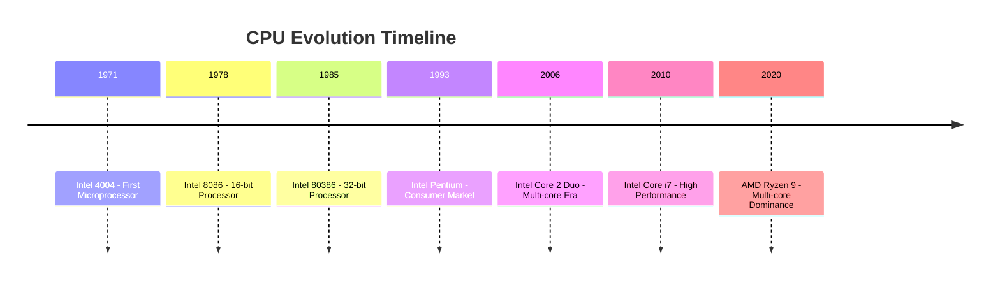

# 🧠 The Role of the CPU

The CPU is the primary component that executes instructions from programs. It fetches data from memory, processes it using arithmetic and logic operations, and stores the results back in memory.

- **Microprocessor**: A complete CPU on a single integrated circuit chip
- **Embedded Systems**: Specialized computers designed for specific functions (e.g., in cars, appliances, security systems)

## CPU Components

The CPU consists of several key components that work together to process instructions:

- **Control Unit (CU)**: Directs the operation of the processor, manages the flow of data, and coordinates activities.
- **Arithmetic Logic Unit (ALU)**: Performs mathematical calculations and logical operations.
- **Registers**: Small, fast storage locations within the CPU for temporary data.
- **Cache Memory**: High-speed memory that stores frequently used data and instructions.

## Interesting Facts About CPUs

- The first microprocessor, the Intel 4004, was released in 1971 and could execute about 60,000 instructions per second.
- Modern CPUs can perform billions of operations per second, with clock speeds measured in GHz (gigahertz).
- Multi-core processors, like those with 8 or more cores, allow parallel processing, enabling tasks like video editing and gaming to run smoother.
- CPUs generate heat during operation, requiring cooling systems like fans or liquid cooling to prevent overheating.

## Evolution of CPUs

CPUs have evolved significantly since their inception:

- **1970s**: Introduction of microprocessors, starting with the Intel 4004.
- **1980s**: 16-bit and 32-bit processors, enabling more complex computing.
- **1990s**: Pentium processors and the rise of personal computing.
- **2000s**: Multi-core CPUs and increased focus on energy efficiency.
- **Present**: Advanced architectures with AI acceleration and quantum computing on the horizon.

