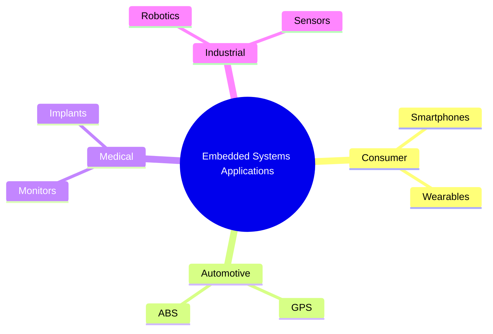

# 🖥️ Embedded Systems

An embedded system is used to perform a dedicated function. For example, domestic appliances, cars, security systems, lighting systems, or vending machines. This is different from a general-purpose computer that is used to perform many different functions, such as a personal computer (PC) or a laptop.

## Characteristics of Embedded Systems

Embedded systems are specialized computer systems designed for specific tasks. Key characteristics include:

- **Dedicated Functionality**: Unlike general-purpose computers, they perform a single or limited set of functions.
- **Real-Time Operation**: Many require timely responses, such as in automotive or medical applications.
- **Resource Constraints**: Often limited in processing power, memory, and power consumption.
- **Integration**: Typically integrated into larger systems or products.

## Applications

Embedded systems are ubiquitous in modern technology. Common applications include:

- **Consumer Electronics**: Smartphones, smart TVs, gaming consoles.
- **Automotive**: Engine control units, infotainment systems, autonomous driving.
- **Medical Devices**: Pacemakers, insulin pumps, MRI machines.
- **Industrial Automation**: Robotics, PLCs (Programmable Logic Controllers).
- **Home Automation**: Smart thermostats, security systems.

### Mind Map

## Design Considerations

Designing embedded systems involves balancing several factors:

- **Power Efficiency**: Critical for battery-powered devices.
- **Reliability**: Must operate without failure in harsh environments.
- **Cost**: Components must be cost-effective for mass production.
- **Security**: Protecting against cyber threats, especially in IoT devices.
- **Scalability**: Ability to update firmware and adapt to new requirements.
