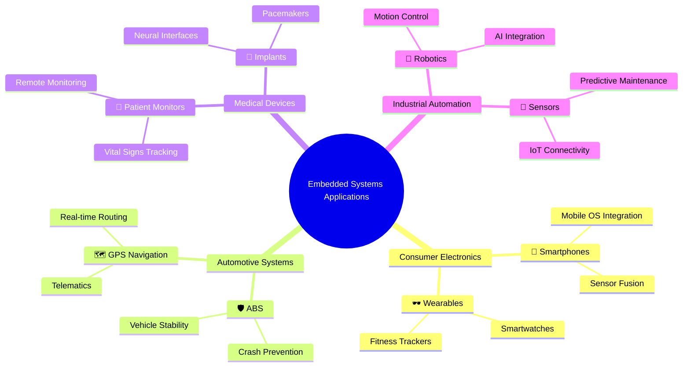

# 🖥️ Embedded Systems

An embedded system is used to perform a **dedicated function**. For example, domestic appliances, cars, security systems, lighting systems, or vending machines. 

This is different from a **general-purpose** computer that is used to perform many different functions, such as a personal computer (PC) or a laptop.

## Characteristics of Embedded Systems

Embedded systems are specialized computer systems designed for specific tasks. Key characteristics include:

- **Dedicated Functionality**: Unlike general-purpose computers, they perform a single or limited set of functions.
- **Resource Constraints**: Often limited in processing power, memory, and power consumption.
- **Integration**: Typically integrated into larger systems or products.

## Applications

Embedded systems are ubiquitous in modern technology. Common applications include:

- **Consumer Electronics**: Smartphones, smart TVs, gaming consoles.
- **Automotive**: Engine control units, infotainment systems, autonomous driving.
- **Medical Devices**: Pacemakers, insulin pumps, MRI machines.
- **Industrial Automation**: Robotics, PLCs (Programmable Logic Controllers).
- **Home Automation**: Smart thermostats, security systems.

### Mind Map

## Suitable sensor for ...❓

**Sensor list:**  
> acoustic, accelerometer, flow, gas, humidity, infrared, level,   
> light, magnetic, moisture, pH, pressure, proximity, temperature

**Fill in the blanks in the following paragraph using words from the list above.** 

Embedded systems use various sensors for different applications.  
🚪 Automatic doors open when a ▀▄▀▄▀▄ sensor detects someone approaching.  
🚨 A burglar alarm might use an ▀▄▀▄▀▄ sensor to detect movement.  
❄️ Air conditioning systems rely on ▀▄▀▄▀▄ sensors to maintain comfortable temperatures.  
💡 Disco lighting can be controlled by ▀▄▀▄▀▄ sensors that react to sound.  
💧 Leak detection systems use ▀▄▀▄▀▄ sensors to identify water presence.  
🚦 Traffic light control employs ▀▄▀▄▀▄ sensors for vehicle detection.  
🌫️ Pollution monitoring stations measure air quality with ▀▄▀▄▀▄ sensors.  
🌱 Greenhouse environments are managed using ▀▄▀▄▀▄ and ▀▄▀▄▀▄ sensors for optimal plant growth. 

### ✅Answers

| Application | Sensor |
|-------------|--------|
| 🚪 Automatic doors | proximity |
| 🚨 Burglar alarm | infrared (or proximity) |
| ❄️ Air conditioning | temperature |
| 💡 Disco lighting | acoustic |
| 💧 Leak detection | flow |
| 🚦 Traffic light | proximity (or pressure) |
| 🌫️ Pollution monitoring | gas |
| 🌱 Greenhouse | humidity and temperature |
