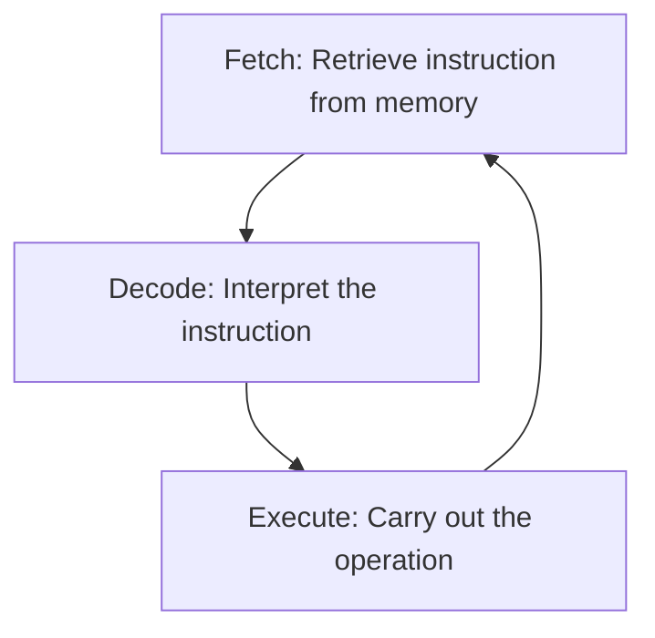

# 🔄 The Fetch-Decode-Execute (FDE) Cycle

### FDE Cycle

## Detailed Explanation of Each Step

### 1. Fetch
In the fetch stage, the CPU retrieves the next instruction from memory. This involves:

- The Program Counter (PC) holding the address of the next instruction.
- The instruction being loaded into the Instruction Register (IR).
- The PC incrementing to point to the next instruction.

### 2. Decode
During decode, the CPU interprets the fetched instruction:

- The Control Unit analyzes the opcode to determine the operation.
- Operands are identified and prepared for execution.
- Registers or memory locations are accessed as needed.

### 3. Execute
The execute stage performs the actual operation:

- Arithmetic or logic operations are carried out by the ALU.
- Data may be stored back to memory or registers.
- The cycle repeats for the next instruction.

