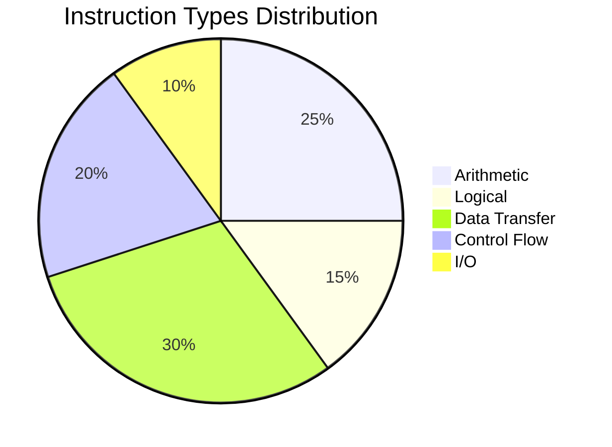
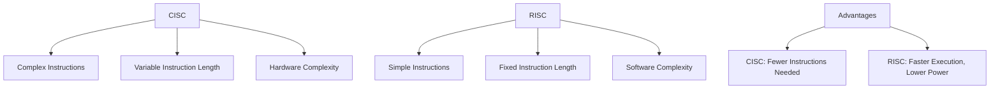

# 📋 Instruction Set

An instruction set is a collection of commands that the CPU can execute. These are machine code instructions that tell the CPU what operations to perform.

## Types of Instructions

Instruction sets typically include several categories of instructions:

- **Arithmetic Instructions**: Perform mathematical operations like addition, subtraction, multiplication, and division.
- **Logical Instructions**: Handle bitwise operations such as AND, OR, XOR, and NOT.
- **Data Transfer Instructions**: Move data between registers, memory, and I/O devices (e.g., LOAD, STORE).
- **Control Flow Instructions**: Manage program flow, including jumps, branches, and subroutine calls.
- **Input/Output Instructions**: Interact with external devices for data input and output.

### Visualization of Instruction Types

## Instruction Set Architectures (ISA)

An Instruction Set Architecture defines the interface between software and hardware. Common types include:

- **CISC (Complex Instruction Set Computing)**: Features a large number of complex instructions. Examples: x86 (used in Intel and AMD processors).
- **RISC (Reduced Instruction Set Computing)**: Uses simpler instructions executed in fewer cycles. Examples: ARM, MIPS.

### Comparison of CISC vs RISC

## Interesting Facts

- **Historical Evolution**: The first instruction sets were developed in the 1940s with computers like ENIAC, which used basic arithmetic and control instructions.
- **Modern Trends**: With the rise of mobile devices, RISC architectures like ARM have become dominant due to their energy efficiency.
- **x86 Dominance**: Despite being CISC, x86 remains the most widely used ISA in desktops and servers, with backward compatibility dating back to the 1970s.
- **Quantum Computing**: Emerging instruction sets for quantum computers are being developed, focusing on quantum gates rather than classical operations.
- **Security Implications**: Instruction sets can include security features like address space layout randomization (ASLR) to prevent exploits.

## Examples of Instruction Sets

- **x86-64**: Extends the original x86 with 64-bit support, used in most modern PCs.
- **ARMv8**: A 64-bit RISC architecture powering smartphones, tablets, and embedded systems.
- **MIPS**: A RISC ISA commonly used in academic settings and some embedded applications.

These enhancements provide a deeper understanding of instruction sets, their types, architectures, and real-world applications.