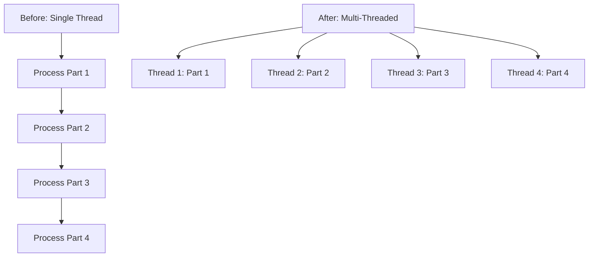
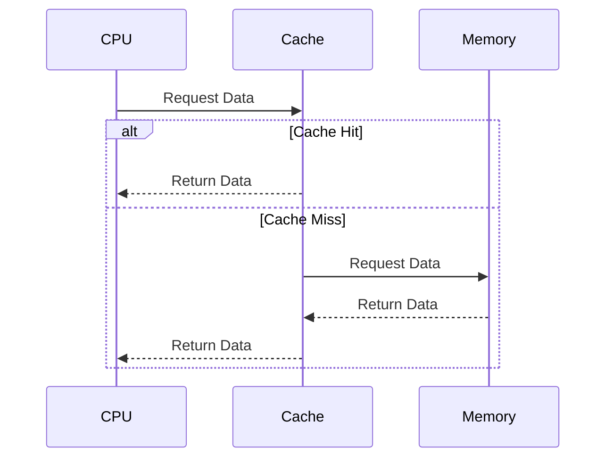
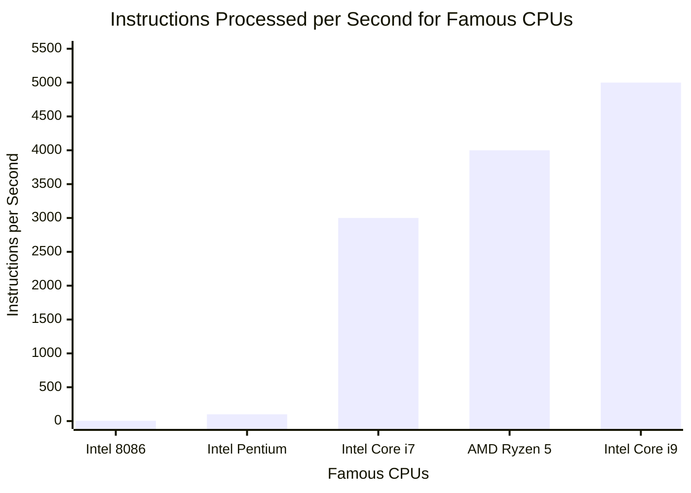

# ⚡ Performance Factors

Several factors affect CPU performance:

- **Cores**: Multiple processing units within a single CPU chip
- **Cache**: High-speed memory that stores frequently used data
- **Clock Speed**: The rate at which the CPU processes instructions

## Cores
Multiple cores allow parallel processing, enabling multitasking and improved performance for multi-threaded applications. For example, a quad-core CPU can handle four tasks simultaneously.

## Cache
Cache memory reduces access time to frequently used data. Cache is integrated directly onto the CPU and operates in multiple levels:

- **L1 Cache**: The smallest and fastest level, located closest to the CPU cores. Typically 32-64 KB per core.
- **L2 Cache**: Larger than L1 but slower, usually 256 KB to 1 MB per core.
- **L3 Cache**: The largest level, shared among all cores on the CPU. Can be several MB, slowest but helps with data sharing between cores.

This hierarchy ensures that frequently accessed data is available with minimal delay.

## Clock Speed
Measured in GHz, it indicates cycles per second. Higher clock speeds mean faster instruction execution, but heat and power consumption increase.

---

## Example❓

- Computer X has a 3.0GHz octa-core processor.  
- Computer Y has a 4.0GHz quad-core processor.  
- Computer Z has a 6.0GHz dual-core processor.  

Identify which computer is most likely to execute more instructions simultaneously.  

Justify your answer.  

---

### ✅ Answer

Computer X

Justification Computer X has an octa-core processor, meaning it has 8 cores that can execute instructions simultaneously. Computer Y has 4 cores, and Computer Z has 2 cores. Therefore, Computer X can handle more parallel tasks and execute more instructions at the same time compared to the others. Clock speed affects individual core performance, but the number of cores determines simultaneous execution capacity.