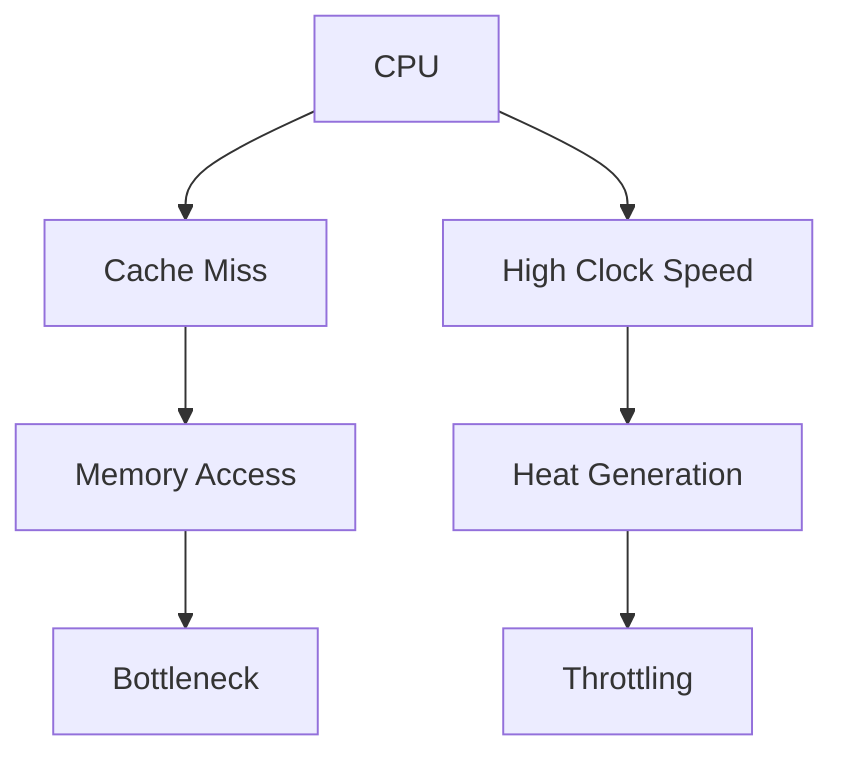
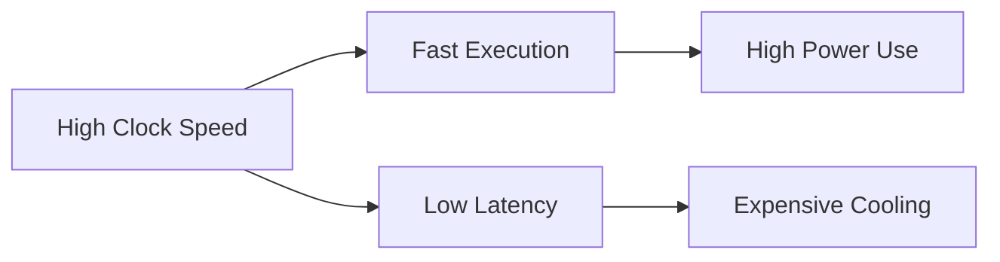

# ⚡ Performance Factors

Several factors affect CPU performance:

- **Cores**: Multiple processing units within a single CPU chip
- **Cache**: High-speed memory that stores frequently used data
- **Clock Speed**: The rate at which the CPU processes instructions

## Detailed Explanations

### Cores
Multiple cores allow parallel processing, enabling multitasking and improved performance for multi-threaded applications. For example, a quad-core CPU can handle four tasks simultaneously.

### Cache
Cache memory reduces access time to frequently used data, bridging the speed gap between CPU and main memory. L1 cache is fastest but smallest, while L3 is larger but slower.

### Clock Speed
Measured in GHz, it indicates cycles per second. Higher clock speeds mean faster instruction execution, but heat and power consumption increase.

## Additional Performance Factors

- **Pipeline**: Breaks instructions into stages for parallel execution, increasing throughput.
- **Branch Prediction**: Predicts program flow to reduce delays in conditional jumps.
- **Memory Hierarchy**: Includes registers, cache, RAM, and storage; optimizing this is crucial.
- **Instruction Set Architecture (ISA)**: Complex ISAs like x86 offer more features but may be slower than simpler RISC designs.

## Interesting Facts

- **Moore's Law**: Predicted that transistor count doubles every two years, driving performance improvements, though it's slowing down.
- **Amdahl's Law**: Performance gain from parallelization is limited by the serial portion of the program.
- **Real-world Example**: The Intel Core i9 has up to 18 cores and 4.9 GHz clock speed, but gaming often benefits more from fewer high-speed cores.
- **Power Wall**: Modern CPUs are limited by power consumption; increasing clock speed exponentially raises heat.

## Performance Bottlenecks

Common bottlenecks include memory latency, I/O operations, and thermal throttling.

## Trade-offs in Performance

Balancing speed, power, and cost.

