# What is a Microphone?

Process:

```mermaid 
graph LR;
     A[Microphone🎤] --> B[⚡];
     B --> C[ADC];
     C --> D[🖥️0️⃣1️⃣];
```

## Video

<iframe width="560" height="315" src="https://www.youtube.com/embed/PE6Qn4ZiEyo" title="YouTube video player" frameborder="0" allow="accelerometer; autoplay; clipboard-write; encrypted-media; gyroscope; picture-in-picture; web-share" allowfullscreen></iframe>

> A microphone is a device that converts sound waves (vibrations in air) into electrical energy.

---

## How a Microphone Works

🤠Microphones convert acoustical energy to electrical energy  
🤠Most mics use a **diaphragm**, a thin material that vibrates when hit by sound waves  
🤠The vibrating diaphragm  moves a coil past an electromagnet...  
🤠... allowing the sound vibrations to be converted to electrical current  
⚡ The electrical signal is then converted to digital (0️⃣1️⃣) using an ADC.
 
 
---
