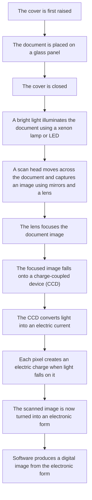

#    Scanners🕵️🔎: Scanning images for you 👁️

Scanner is a type of input devices that converts a physical document or image in to a digital format.It can also be a software utility that reads and processes input from a source.

##   Different Types of Scanners
  
 There are mainly 3 types of scanners:

- **Barcode Scanners**
- **Two Dimensional Scanners**
- **Three Dimensional Scanners**

###   Barcode Scanners 𝄃𝄃𝄂𝄂𝄀𝄁𝄃𝄂𝄂𝄃
 
A barcode is a series of dark and light parallel lines varying thinckness.The number 0 to 9 are each represented by a unique series of lines. There are various barcode methods for representing these digits. 

A barcode is scanned by following these steps:
     
**1**. The barcode is readed by a red laser or red LED.

**2**. Light is reflected back off the barcode; the dark areas reflect little or no light,which allows the bar to be read.

**3**. The reflected light is read by sensors.(Photoelectric Cells). 

**4**. As the laser or LED light is scanned across the barcode, a pattern is generated, which is converted into digital data- this allows the computer to understand the barcode. 

Barcodes are most commonly found at the checkout in supermarket🥦🥩🍖

There are some types of more advanced barcode scanners, for example, QR Code.

### Quick Response (QR) codes

A QR code consists of a block of small squares (light and dark) known as pixels.
It can presently hold up to 4296 characters (or up to 7089 digits) and also
allows internet addresses to be encoded within the QR code. This compares to
the 30 digits that is the maximum for a barcode. However, as more and more
data is added, the structure of the QR code becomes more complex.

By using the built-in camera on a mobile smartphone or tablet and by
downloading a QR app (application), it is possible to read QR codes on the move
using the following method:

**1**.Point the phone or tablet camera at the QR code.
 
**2**.The app will now process the image taken by the camera, converting the
squares into readable data.

**3**.The browser software on the mobile phone or tablet automatically reads the
data generated by the app; it will also decode any web addresses contained
within the QR code

**4**.The user will then be sent to a website automatically (or if a telephone
number was embedded in the code, the user will be sent to the phone
app )

**5**.If the QR code contained a boarding pass, this will be automatically sent to
the phone/tablet.

### 2D & 3D Scanners

Scanners are either two dimensional (2D) or three dimensional (3D).

#### 2D Scanners🟦
These types of scanner are the most common form and are generally used to
input hard copy (paper) documents. The image is converted into an electronic
form that can be stored in a computer.

A number of stages occur when scanning a document:

#### 3D Scanners🧊

3D scanners scan solid objects and produce a three-dimensional image. Since solid
objects have x, y and z coordinates, these scanners take images at several points along these three coordinates. A digital image which represents the solid object is formed.

The scanned images can be used in computer aided design (CAD) or, more
recently, sent to a 3D printer to produce a working model of
the scanned image.

There are numerous technologies used in 3D scanners – lasers, magnetic
resonance, white light, and so on. It is beyond the scope of this book to look at
these in any great depth; however, the second application that follows describes
the technology behind one form of 3D scanning.

####Application of 2D Scanning✈️

2D scanners are used at airports to read passports. They make use of OCR technology to produce digital images which represent the passport pages. Because of the
OCR technology, these digital images can be manipulated in a number of ways.

For example, the OCR software is able to review these images, select the text
part, and then automatically put the text into the correct fields of an existing
database. It is possible for the text to be stored in an ASCII format – it all
depends on how the data is to be used.

At many airports the two-dimensional photograph in the passport is scanned and
stored as a JPEG image. The passenger’s face is also photographed using a digital
camera (a 2D image is taken so it can be matched to the image taken from the
passport). The two digital images are compared using face recognition/detection
software.

#### Application of 3D Scanning 

Computed tomographic (CT) scanners are used to create a 3D image of a solid
object. This is based on tomography technology, which basically builds up an
image of the solid object through a series of very thin ‘slices’. Each of these 2D
‘slices’ make up a representation of the 3D solid object.

Each slice is built up by use of X-rays, radio frequencies or gamma imaging;
although a number of other methods exist. Each ‘slice’ is then stored as a digital
image in the computer memory. The whole of the solid object is represented
digitally in the computer memory.

