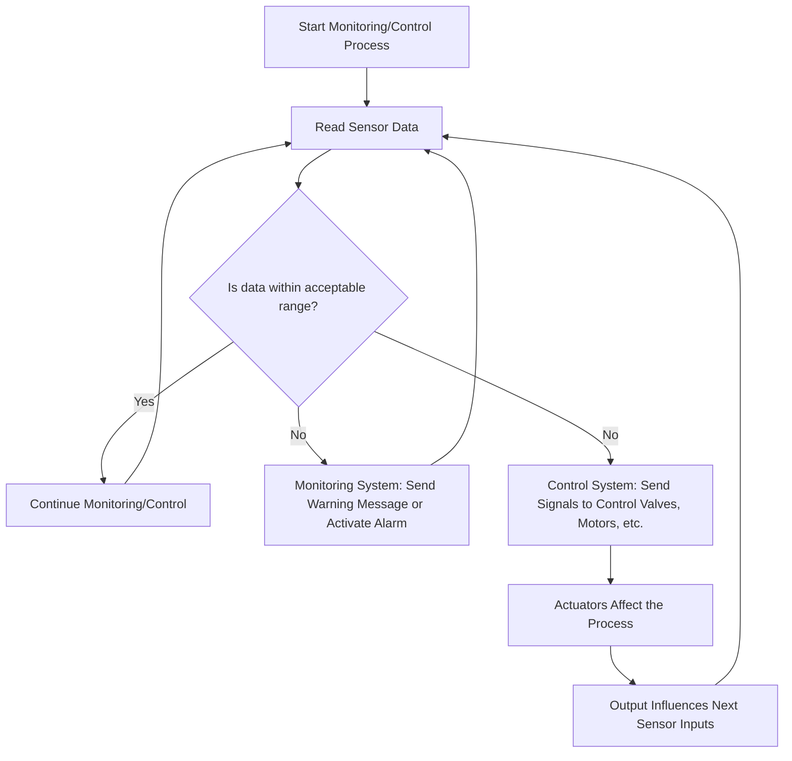

# Sensors 📡📟

- Sensors are input devices which measure a property of their environment (light, temperature etc.)
- In order to convert the data from the sensor into data which a computer can use, an ADC (analogue to digital converter) must be used.
- If a reading is used to alter the sensor in some way to affect the next reading taken, it is known as a feedback loop.
---

## Types of Sensors
|Name          |Descriptions                   |Image                 |
|:------------:|:----------------------:|----------------------|
|**Temperature🌡️**   | Measures temperature using signals, used to maintain temperature in control environments.     ||
|**Sound🔊**         | Measures sound levels and converts them to, used in security systems or for detecting machinery noises.  | 
|**Light☀️**| Measures light levels, used in automatic light systems||
|**Moisture💦**| Measures the water level in substances such as soil, similar to humidity sensors. Used in things like greenhouses.| |
|**Humidity💨**| Similar but different to moisture, measures the amount of water vapour in a gas| |
---
## Monitoring & Control Systems 💻

Sensors are used for both monitoring and control systems, which have some minor differences.
-  A monitoring system would simply read the data from the sensor and allow it to be viewed.
- A control system would read the data and make changes until the intended conditions are met.

### Flowchart
---

### Examples
---
#### Monitoring
- The monitoring of a patient in a hospital
- The monitoring of intruders in a security system
- Checking the temperature levels of machinery
- Monitoring pollution levels

#### Control
- A system which turns on lights when it's night and turn's them off when it's day
- Controlling the conditions for a chemical process
- Controlling the temperature of a cooling/heating system   