# What is a Touch Screen? 📱

```mermaid
graph LR;
    A[Touch Screen 📱] --> B[Resistive 👆];
    A --> C[Capacitive ⚡];
    A --> D[Infra-red 💥];
    B --> E[Pressure Sensitive];
    C --> F[Capacitance Change];
    D --> G[Light Beam Interruption];
```

> A touch screen is an input device that allows users to interact with a computer by touching the display screen directly, eliminating the need for a separate pointing device like a mouse.

---

## Resistive Touch Screens 👆

**How it works:**

- A resitive touch-screen consists of two layers separated by a small gap.
- The outer layer is made of flexible plastic, and the inner layer is made of glass coated with a conductive material.
- When you press the screen, the two layers touch, **completing a circuit**.
- Point of contact is registered and **coordinates calculated**.
- Works with any object, including fingers, styluses, or gloves.

**Advantages:**

- Works with any input (finger, stylus, etc.)  
- Relatively inexpensive  
- Durable and resistant to scratches  

**Disadvantages:**  

- Requires pressure, so not as responsive  
- Lower image clarity due to multiple layers  
- Can wear out over time  

---

## Capacitive Touch Screens ⚡

 *(image to be updated)*

**How it works:**

- Capacitive touch-screens uses a layer of capacitive material on the glass surface.  
- The screen creates an **electrostatic field** that stores electrical charge.  
- When you touch the screen with your finger (which conducts electricity), it draws a small amount of charge, changing the capacitance.  
- The system detects this change and **calculates** the touch position **coordinates**.  

**Advantages:**  

- High sensitivity and responsiveness  
- Supports multi-touch gestures  
- Clearer image quality  
- Works well in various lighting conditions  

**Disadvantages:**  

- Only works with conductive objects (fingers, special styluses)  
- More expensive than resistive  
- Can be affected by water or dirt on the surface  

---

## Infra-red Touch Screens 💥

 *(image to be updated)*

**How it works:**

- Uses a frame around the screen with infrared **LEDs** and **light detectors**.  
- The LEDs emit invisible **infrared light beams** across the screen surface forming a **grid**.  
- When you touch the screen, your finger interrupts some of these beams.  
- The system detects which beams are broken and **calculates** the touch position.  

**Advantages:**  

- Works with any object (finger, stylus, glove)  
- High durability and resistance to scratches  
- Can detect multiple touches  
- Unaffected by surface contaminants  

**Disadvantages:**  

- More expensive than resistive screens  
- Can be affected by bright ambient light  
- Requires a clear line-of-sight for the IR beams  

---

These three types of touch screens offer different trade-offs in terms of cost, durability, and functionality, making them suitable for various applications from smartphones to industrial controls.