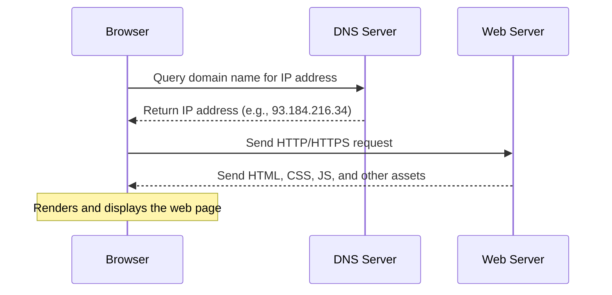

# 🌐 How Web Pages Are Loaded

When you enter a **URL** into your web browser and press Enter, a whole sequence of events takes place behind the scenes! Let’s explore how a web page is **located**, **retrieved**, and **displayed** on your device.

---

## 1️⃣ The Web Browser 🧭

Your **web browser** starts the process by taking the URL you entered (e.g. `https://example.com`) and trying to find the **IP address** of the web server that hosts the website.

---

## 2️⃣ Domain Name System (DNS) 📡

The browser contacts a **DNS (Domain Name Server)** to translate the **domain name** (`example.com`) into an **IP address** (e.g. `93.184.216.34`), which is needed to locate the web server.

> 🧠 Think of DNS as the **phone book of the internet** – it matches human-readable names to machine-readable numbers!

---

## 3️⃣ Contacting the Web Server 🖥️

With the IP address in hand, your browser sends a **request** to the **web server** where the website is hosted.

> 🌐 This request is usually made using the **HTTP** or **HTTPS** protocol.

---

## 4️⃣ The Web Server Responds 📤

The web server receives the request and **sends back the HTML** (HyperText Markup Language) file, along with any other resources needed, such as:

- 🖼️ Images
- 🎨 CSS files (styling)
- ⚙️ JavaScript files (interactivity)

---

## 5️⃣ Rendering the Web Page 🖼️

Your browser receives the files and begins to **render the HTML** into a readable and interactive web page.

> This includes displaying text, images, formatting styles, and adding interactivity.

---

## 🔁 Summary of the Process

1. You type a **URL** into your browser 🔤
2. Browser uses **DNS** to find the server's IP address 📡
3. Sends an **HTTP(S)** request to the **web server** 💻
4. Server sends back **HTML and assets** 🧾
5. Browser **renders and displays** the page 🎨

---