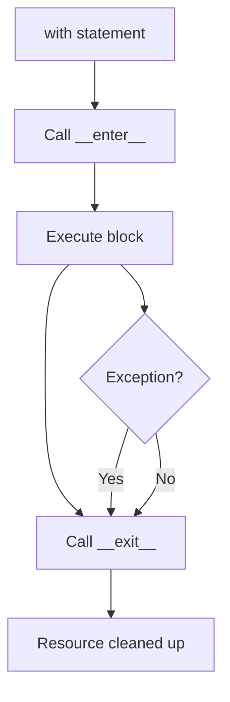

# Context Managers in Python

Context managers in Python are objects that define the methods `__enter__` and `__exit__` to handle resource management, ensuring that setup and cleanup actions are performed automatically. They are typically used with the `with` statement, which guarantees that resources are properly acquired and released, even if an exception occurs during execution. This follows the Resource Acquisition Is Initialization (RAII) pattern, common in languages like C++.

## How Context Managers Work

When you use `with some_context_manager as variable:`, Python calls the `__enter__` method to set up the resource and assigns its return value to `variable`. After the block executes, `__exit__` is called to clean up, regardless of whether an exception was raised. The `__exit__` method receives exception details (type, value, traceback) and can suppress exceptions by returning `True`.

You can create a context manager by:

- Defining a class with `__enter__` and `__exit__` methods.
- Using the `@contextmanager` decorator from the `contextlib` module to turn a generator function into a context manager.

## Example Uses

Context managers are commonly used for managing resources like files, network connections, locks, and database transactions. Here are some built-in and custom examples:

1. **File Handling (Built-in)**:

   ```python
   with open('file.txt', 'r') as f:
       data = f.read()
   # File is automatically closed here, even if an error occurs
   ```

   This ensures the file is closed properly, preventing resource leaks.

2. **Database Connections**:

   ```python
   import sqlite3

   with sqlite3.connect('database.db') as conn:
       cursor = conn.cursor()
       cursor.execute('SELECT * FROM table')
       results = cursor.fetchall()
   # Connection is automatically closed
   ```

3. **Threading Locks**:

   ```python
   import threading

   lock = threading.Lock()
   with lock:
       # Critical section
       shared_resource += 1
   # Lock is automatically released
   ```

4. **Custom Context Manager for Timing**:

   ```python
   import time
   from contextlib import contextmanager

   @contextmanager
   def timer():
       start = time.time()
       try:
           yield
       finally:
           end = time.time()
           print(f"Elapsed time: {end - start:.2f} seconds")

   with timer():
       # Some code to time
       time.sleep(1)
   ```

5. **Suppressing Exceptions**:

   ```python
   from contextlib import contextmanager

   @contextmanager
   def suppress_errors():
       try:
           yield
       except Exception:
           pass  # Suppress all exceptions

   with suppress_errors():
       raise ValueError("This won't propagate")
   ```

## When to Make/Use Your Own Context Managers

You should create or use custom context managers when you need to manage resources that require explicit setup and teardown, especially if those resources could leak or cause issues if not properly handled. Common scenarios include:

- **Resource Management**: When dealing with external resources like files, sockets, or database connections that need to be opened and closed.
- **Temporary State Changes**: For temporarily altering state (e.g., changing working directories, redirecting stdout, or mocking in tests).
- **Synchronization**: Managing locks, semaphores, or other concurrency primitives.
- **Cleanup Logic**: Ensuring cleanup happens even with exceptions, such as rolling back transactions or releasing memory.
- **Reusability**: If the same setup/teardown pattern is repeated, encapsulate it in a context manager for cleaner, more maintainable code.

Use built-in ones (like `open`, `threading.Lock`) when available, but create custom ones via classes or `@contextmanager` when you need specific behavior. For example, if you're building a library that interacts with an API, a context manager can handle authentication and session cleanup automatically.



This diagram illustrates the flow: setup, execution, and guaranteed cleanup.