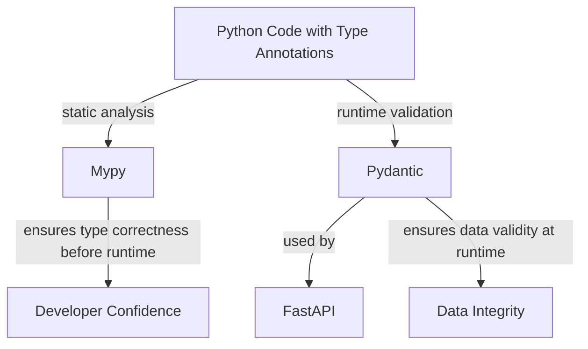

# 🧩 Mypy, and Pydantic Overview

## 1. Mypy

**What it is:**  
Mypy is a **static type checker** for Python.  
It reads your type annotations and checks for consistency — without running your code.

**Example:**
```bash
mypy app.py
```

If `app.py` contains:
```python
def add(x: int, y: int) -> int:
    return x + y

add("hello", "world")
```

You’ll get:
```
error: Argument 1 to "add" has incompatible type "str"; expected "int"
```

✅ **Use case:** Catch type-related bugs *before* execution, especially in large or complex projects.

---

## 2. Pydantic

**What it is:**  
Pydantic is a **runtime data validation** and **parsing** library.

It uses your type annotations to:

- validate input data (e.g. from JSON),
- coerce types where possible,
- and raise informative errors when validation fails.

**Example:**
```python
from pydantic import BaseModel

class User(BaseModel):
    id: int
    name: str
    is_active: bool = True

user = User(id="123", name="Alice")
print(user.id)  # 123 (auto-converted to int)
```

If invalid:
```python
User(id="abc", name=123)
```
--> Raises a runtime validation error.

---

## 3. How They Work Together

| Concept | When It Runs | Purpose | Example Tool |
|----------|---------------|----------|---------------|
| **Type annotations** | Static | Describe data types | Built-in (`typing`) |
| **Mypy** | Static | Enforce type correctness | `mypy` |
| **Pydantic** | Runtime | Validate and coerce external data | `pydantic` |

Together:

- Write **type hints** once.  
- **Mypy** checks logic consistency.  
- **Pydantic** validates real-world input (like API requests).

---

## 4. Diagram



---

## 5. Folder-Level Example

```
my_fastapi_app/
│
├── app/
│   ├── __init__.py
│   ├── main.py              # FastAPI entry point
│   ├── models.py            # Pydantic models (data schemas)
│   ├── routes/
│   │   ├── __init__.py
│   │   └── items.py         # Route for /items endpoint
│   └── services/
│       ├── __init__.py
│       └── pricing.py       # Business logic using type annotations
│
├── tests/
│   ├── test_items.py
│   └── test_validation.py
│
├── requirements.txt
├── pyproject.toml           # Mypy + Ruff configs
└── README.md
```

---

### Example Files

**`models.py`**
```python
from pydantic import BaseModel

class Item(BaseModel):
    name: str
    price: float
    quantity: int = 1
```

**`services/pricing.py`**
```python
def calculate_total(price: float, quantity: int) -> float:
    return price * quantity
```

**`routes/items.py`**
```python
from fastapi import APIRouter
from app.models import Item
from app.services.pricing import calculate_total

router = APIRouter()

@router.post("/items/")
def create_item(item: Item) -> dict[str, float]:
    total = calculate_total(item.price, item.quantity)
    return {"total": total}
```

**`main.py`**
```python
from fastapi import FastAPI
from app.routes import items

app = FastAPI()
app.include_router(items.router)
```

---

## 6. Running and Checking

- **Run Mypy**:
  ```bash
  mypy app/
  ```

- **Run FastAPI**:
  ```bash
  uvicorn app.main:app --reload
  ```
