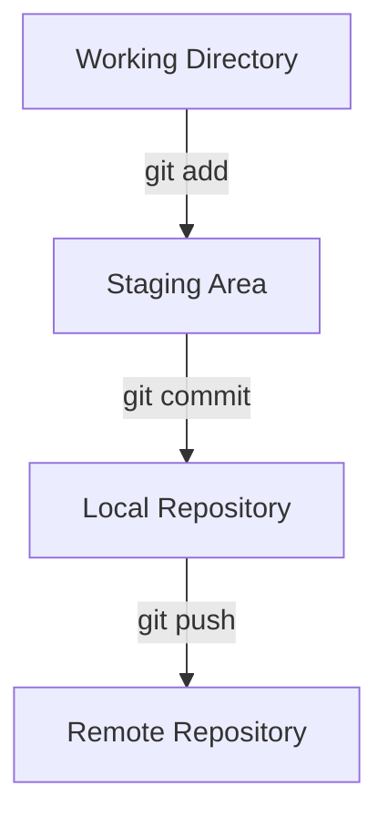

# 🧰 Git Beginner Guide & Cheat Sheet

A simple, beginner-friendly guide to using Git from the command line.

---

## 🔑 Step 1: Set up Git

```bash
git config --global user.name "Your Name"
git config --global user.email "your.email@example.com"
git config --list
```

---

## 📁 Step 2: Create or Clone a Repository

### A. Create a new repo
```bash
mkdir my-project
cd my-project
git init
```

### B. Clone an existing repo
```bash
git clone https://github.com/username/repo-name.git
cd repo-name
```

---

## 🔄 Step 3: Git Workflow

📝 Stage changes when you've edited files and want to prepare specific modifications for the next commit.

💾 Commit when your staged changes represent a complete, logical unit of work with a clear purpose.

🚀 Push when you want to share your committed changes with the remote repository for collaboration.



## ✅ Step 4: Basic Commands

### Check repo status
```bash
git status
```

### Stage files
```bash
git add filename.txt     # stage one file
git add .                # stage all changes
```

### Commit changes
```bash
git commit -m "Your commit message"
```

### View commit history
```bash
git log
```

---

## 🌐 Step 5: Remote Repositories

### Add a remote
```bash
git remote add origin https://github.com/username/repo-name.git
```

### Push to GitHub
```bash
git push -u origin main
```

### Pull from remote
```bash
git pull
```

---

## 🛠️ Step 6: Helpful Commands

### See changes
```bash
git diff
git diff --staged
```

### Unstage a file
```bash
git reset HEAD filename.txt
```

### Undo file changes
```bash
git checkout -- filename.txt
```

---

## 🌿 Step 7: Branching

### Create and switch to a branch
```bash
git checkout -b new-feature
```

### Merge a branch
```bash
git checkout main
git merge new-feature
```

### Delete a branch
```bash
git branch -d branch-name
```

---

## 🧼 Step 8: Clean Up

### Remove untracked files
```bash
git clean -f
```

---

## 🧠 Git Cheat Sheet

| Task | Command |
|------|---------|
| Initialize repo | `git init` |
| Clone repo | `git clone URL` |
| Stage changes | `git add .` |
| Commit changes | `git commit -m "msg"` |
| Check status | `git status` |
| Push to GitHub | `git push` |
| Pull from GitHub | `git pull` |
| Create branch | `git checkout -b name` |
| Merge branch | `git merge name` |
| View log | `git log` |

---

**Happy Git-ing!** 🎉
