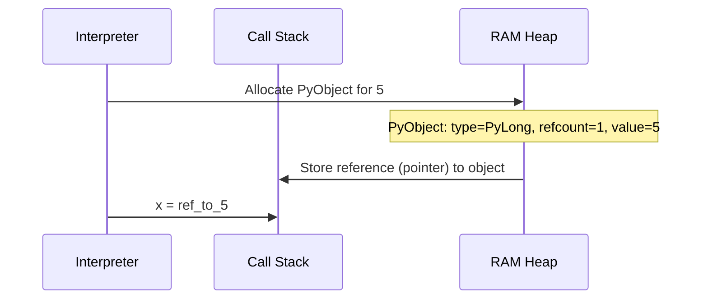

# Python Memory Management for Types

## Introduction

Python handles data types and memory allocation using dynamic typing and high-level abstractions. This document explains Python's approach to types in memory and includes diagrams visualizing RAM allocation.

## Python's Approach to Types in Memory

In Python, everything is an object. Variables are references to objects stored in heap memory.

- **Dynamic Typing**: Types are determined at runtime. No compile-time checks.
- **Objects**: Each value (int, str, list) is a PyObject with type info, reference count, and data.
- **Memory Allocation**: Uses a private heap managed by the interpreter. Use of sys.getsizeof() shows object size, but includes overhead.
- **Reference Counting**: Tracks object usage; deallocates when count reaches zero.
- **Garbage Collection**: Handles cycles via cyclic GC, causing pauses.
- **Example**: Assigning `x = 5` creates an integer object in heap; x points to it.

This abstraction allows flexibility but adds overhead: every operation involves dereferencing pointers and type checks.

## Mermaid Diagram: Python Variable Assignment in RAM

Visualizes creating and assigning a variable, showing heap allocation and reference.

## Conclusion

Understanding Python's memory model highlights its trade-offs: ease of use from abstractions, with performance costs from overhead and garbage collection. For performance-critical code, consider optimizations like PyPy or C extensions (e.g., ctypes).